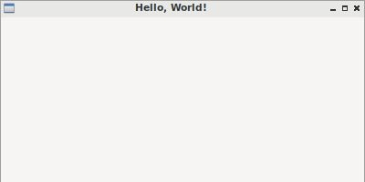

====================
Introducing wxPython
====================

**wxPython** (https://wxpython.org/) è una libreria grafica open source, adatta alla creazione di GUI (interfacce grafiche) per sistemi Windows, Mac e Linux. 

WxPython deriva dal toolkit wxWidgets (https://wxwidgets.org), libreria grafica C++ con una tradizione più che ventennale. Con la versione 4.x che noi utilizzeremo (codenamed *Phoenix*) ha subito una profonda revisione e modernizzazione, fino a diventare la libreria grafica preferita dallo stesso von Rossum (l'inventore di Python). E chissà che presto non diventi la libreria grafica predefinita!

Si presenta come una libreria Python 3.x completamente orientata agli oggetti e
quindi sarà di immediato utilizzo per tutti noi, non appena avremo introdotto
la sua struttura e gli oggetti principali.

Vediamo innanzitutto un primo assaggio di codice, il famoso programma *Hello World!* per la libreria wxPython:

.. code:: python

    # si importa la libreria wx
    import wx

    # si crea un oggetto Applicazione
    app = wx.App()

    # si crea una finestra con titolo "Hello, World!"
    window = wx.Frame(None, title="Hello, World!")
    window.Show()

    # si avvia il "Main Event Loop"
    app.MainLoop()
    

.. note:: 

    Gli *Hello World Programs* sono programmi che scrivono (o mostrano) semplicemente la scritta "Hello, World!".
    
    Sono tipicamente i primi programmi che si vuole scrivere in un qualsiasi
    linguaggio di programmazione e servono soprattutto a vedere la struttura e la sintassi del linguaggio, oltre che ad assicurarsi che tutto funzioni.
    

Il risultato dell'esecuzione di quel codice è questo!

Come primo step non mi sembra complicatissimo! Lo proveremo dal vivo non appena avremo installato la libreria **wxPython** nel prossimo step!
