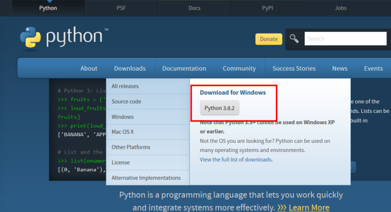

============
Installation
============

La libreria wxPython è una libreria OOP Python in tutto e per tutto. La trovate come tantissime altre sul **Python Package Index** e per installarla, 
se sapete quello che state facendo, basta un semplicissimo:

.. code:: bash
    
    $ pip install wxpython

Se invece avete bisogno di una procedura guidata, ho preparato due percorsi alternativi a seconda dell'editor python che intendete utilizzare.

.. warning::
  Su Windows i due percorsi proposti sono assolutamente scollegati fra loro, quindi se installate wxpython con il primo e poi decidete di
  utilizzare il secondo editor, per avere la libreria dovete rieseguire la procedura relativa.
  

Installare con Thonny
=====================

Aprite `Thonny <https://thonny.org>`_ e accedete al suo gestore dei pacchetti:

.. image:: images/wxpython_install_0.jpg

Da lì digitate la stringa **wxpython** e cliccate su *Trova una pacchetto PyPi* (Ma chi ha fatto la traduzione di Thonny???)

.. image:: images/wxpython_install_1.jpg

A questo punto vi basta semplicemente cliccare **INSTALLA** e aspettare :)

.. image:: images/wxpython_install_2.jpg

Quando il download e l'installazione sono finiti è possibile provare direttamente l'Hello World Program della prima pagina. 

Installare con Python IDLE
==========================

Devo premettere che questa procedura è necessaria solo su Windows. Su Mac e Linux Python dovrebbe già essere installato, aggiornato e inserito nel
PATH, ovvero le tre cose che dovremo fare con questa mini-guida.

L'idea migliore è dunque quella di disinstallare Python e reinstallarlo aggiornato e corretto seguendo la procedura qui indicata.

Scaricate il pacchetto Python dal sito https://www.python.org/.

Scaricato il pacchetto di installazione, avvialo e alla finestra iniziale di configurazione imposta come in figura, aggiungendo Python al PATH.

Al termine dell'installazione riavvia il computer (in teoria basterebbe solo uscire e rientrare nel proprio account) per caricare le nuove impostazioni
di ambiente. Quando sei rientrato nel tuo account, apri il prompt dei comandi e digita:

.. code:: bash
    
    $ pip install wxpython

Attendi che **pip** faccia quello che deve fare... fatto! Tutto qui!

Provate infine l'Hello World della prima pagina per assicurarvi che tutto funzioni!!!
