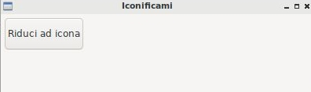

=======
Widgets
=======

.. warning::
    Negli esempi che seguono, scritti con l'unico obiettivo di presentare le widget, andremo a posizionare più oggetti
    nella stessa finestra tramite il cosiddetto **posizionamento assoluto**, inserendo tutte le widget in un **wx.Panel** e
    indicando posizione (pos) e dimensione (size) degli oggetti.

    Questo modo di fare, pur semplice e intuitivo, è comunque assolutamente sconsigliato e sarà sostituito nel prossimo capitolo 
    da un concetto molto più avanzato e funzionale.

In questa sezione andremo ad inserire le Widgets più semplici, per capire come sono fatte e come funzionano. Per ognuna di esse sarà proposta
una descrizione sommaria delle sue caratteristiche, un'immagine esplicativa e un semplice esempio di codice per testare il funzionamento di base.

Ricordo che la documentazione completa di ognuna di queste widget è disponibile nella apposita sezione.

wx.Button
=========

La classe wx.Button rappresenta una widget che implementa un pulsante cliccabile con una etichetta di testo dentro.

Nell'esempio proposto quando si clicca il pulsante (evento **wx.EVT_BUTTON**) si riduce ad icona l'applicazione.

.. code:: python

    import wx

    class Esempio(wx.Frame):
        
        def __init__(self):
            super().__init__(None, title="Iconificami")
            pannello = wx.Panel(self)
            self.pulsante = wx.Button(pannello, label="Riduci ad icona", pos=(5,5), size=(100,40))
            self.pulsante.Bind(wx.EVT_BUTTON, self.iconifica)
            
        def iconifica(self, event):
            self.Iconize()

    # ----------------------------------------
    app = wx.App()

    window = Esempio()
    window.Show()

    app.MainLoop()

    
wx.ToggleButton
===============

La classe wx.ToggleButton rappresenta una widget che implementa un pulsante con due stati: cliccato e non cliccato.

.. image:: images/wxToggleButton.jpg

Nell'esempio proposto quando si clicca il ToggleButton (evento **wx.EVT_TOGGLEBUTTON**) si mette a schermo intero la finestra
e si cambia la scritta sul pulsante (che rimane cliccato). Cliccandolo di nuovo si ritorna alla situazione iniziale.

.. code:: python

    import wx

    class Esempio(wx.Frame):
        
        def __init__(self):
            super().__init__(None, title="Fullscreen(er)")
            self.fsButton = wx.ToggleButton(self, label="Metti fullscreen")
            self.fsButton.Bind(wx.EVT_TOGGLEBUTTON, self.mettiFullScreen)
            
        def mettiFullScreen(self, event):
            if not self.IsFullScreen():
                self.ShowFullScreen(True)
                self.fsButton.SetLabel("Esci dal fullscreen")
            else:
                self.ShowFullScreen(False)
                self.fsButton.SetLabel("Metti fullscreen")

    # ----------------------------------------
    app = wx.App()

    window = Esempio()
    window.Show()

    app.MainLoop()

    
wx.StaticText
=============

La classe wx.StaticText rappresenta una widget che implementa una etichetta dove il programmatore può inserire un testo da visualizzare all'utente.

.. image:: images/wxStaticText.jpg

Nel semplicissimo esempio proposto, viene utilizzato la widget wx.StaticText per visualizzare una poesia in più righe.

.. code:: python

    import wx

    class Esempio(wx.Frame):
        
        def __init__(self):
            super().__init__(None, title="Soldati")
            testo = "\nSi sta come\nd'autunno\nsugli alberi\nle foglie\n"
            self.etichetta = wx.StaticText(self, label=testo)

    # ----------------------------------------
    app = wx.App()

    window = Esempio()
    window.Show()

    app.MainLoop()

wx.StaticLine
=============

La classe wx.StaticLine rappresenta una widget che implementa una linea decorativa, orizzontale o verticale.

.. image:: images/wxStaticLine.jpg

Inserire una wx.StaticLine è veramente semplice e serve solo a scopo decorativo. Approfitto di questa per farvi vedere come modificare il font 
di una wx.StaticText e realizzare una widget con titolo, linea, testo.

.. code:: python

    import wx

    class Esempio(wx.Frame):
        
        def __init__(self):
            super().__init__(None, title="Poesia")
                
            font = wx.Font(20,wx.DEFAULT,wx.NORMAL,wx.BOLD)
            self.titolo = wx.StaticText(self, label="Soldati",pos=(10,10), size=(200,30))
            self.titolo.SetFont(font)
            
            wx.StaticLine(self, pos=(10,50), size=(200,3))
            
            testo = "\nSi sta come\nd'autunno\nsugli alberi\nle foglie\n"
            self.etichetta = wx.StaticText(self, label=testo, pos=(10,60), size=(200,100))
        
    # ----------------------------------------
    app = wx.App()

    window = Esempio()
    window.Show()

    app.MainLoop()

    

wx.ComboBox
===========

La classe wx.ComboBox rappresenta una widget che implementa un menù a tendina

.. image:: images/wxComboBox.jpg

Nell'esempio proposto vediamo una etichetta e un menù a tendina. Selezionando una voce del menù a tendina (evento **wx.EVT_COMBOBOX**) si modifica il contenuto
dell'etichetta.

.. code:: python

    import wx

    class Esempio(wx.Frame):
        
        def __init__(self):
            super().__init__(None, title="Cambia l'etichetta")
                
            self.etichetta = wx.StaticText(self, label="seleziona una voce",
                                        pos=(5,5), size=(200,30))
            frutta = ["pere", "mele", "arance", "banane"]
            self.combo = wx.ComboBox(self, choices=frutta,
                                    pos=(5,40), size=(200,30))
            self.combo.Bind(wx.EVT_COMBOBOX, self.visualizzaSelezione)
            
        def visualizzaSelezione(self, event):
            f = event.GetString()
            self.etichetta.SetLabel("Hai selezionato: " + f)
            return
        
    # ----------------------------------------
    app = wx.App()

    window = Esempio()
    window.Show()

    app.MainLoop()

wx.CheckBox
===========

La classe wx.CheckBox rappresenta una widget che implementa una casella di spunta.

.. image:: images/wxCheckBox.jpg

Nell'esempio proposto abbiamo una sola casella di spunta che quando viene abilitata imposta lo sfondo rosso della finestra, riportando
quello originale se deselezionata.

.. code:: python

    import wx

    class Esempio(wx.Frame):
        
        def __init__(self):
            super().__init__(None, title="Cambia il colore di sfondo")
            
            self.color = self.GetBackgroundColour()
            
            self.check = wx.CheckBox(self, label="sfondo rosso")
            self.check.Bind(wx.EVT_CHECKBOX, self.cambiaSfondo)
            
        def cambiaSfondo(self, event):
            if self.check.GetValue():
                self.SetBackgroundColour("red")
            else:
                self.SetBackgroundColour(self.color)
            return
        
    # ----------------------------------------
    app = wx.App()

    window = Esempio()
    window.Show()

    app.MainLoop()

    

wx.RadioButton
==============

La classe wx.RadioButton rappresenta una widget che implementa un pulsante selezionabile in maniera mutualmente esclusiva.

.. image:: images/wxRadioButton.jpg

Per definire il comportamento tipico dei RadioButton della mutua esclusività si deve dichiarare nella prima widget lo stile **wx.RB_GROUP**:
tutte le RadioButton seguenti faranno parte del gruppo del primo. Se si vuole iniziare un nuovo gruppo, basterà inserire di nuovo lo stile necessario.

Nell'esempio proposto saranno inserite 2 radio buttons per selezionare il sesso (M/F). Al click su una di loro (evento **wx.EVT_RADIOBUTTON**) l'altra
si deselezionerà automaticamente e l'etichetta sotto verrà aggiornata.

.. code:: python

    import wx

    class Esempio(wx.Frame):
        
        def __init__(self):
            super().__init__(None, title="Seleziona una opzione")
            
            self.rbM = wx.RadioButton(self, label="Maschio", style=wx.RB_GROUP, pos=(5,5))
            self.rbF = wx.RadioButton(self, label="Femmina", pos=(5,35))
            self.testo = wx.StaticText(self, label="Voce selezionata: Maschio", pos=(5,65))
            
            self.rbM.Bind(wx.EVT_RADIOBUTTON, self.impostaSesso)
            self.rbF.Bind(wx.EVT_RADIOBUTTON, self.impostaSesso)
            
        def impostaSesso(self, event):
            if self.rbM.GetValue():
                self.testo.SetLabel("Hai selezionato: Maschio")
            else:
                self.testo.SetLabel("Hai selezionato: Femmina")
            return
    # ----------------------------------------
    app = wx.App()

    window = Esempio()
    window.Show()

    app.MainLoop()

wx.Gauge
========

La classe wx.Gauge rappresenta una widget che implementa una barra di avanzamento.

.. image:: images/wxGauge.jpg

La barra di avanzamento va impostata indicando il range predefinito. In questo esempio ho messo range=10 e questo significa che la barra si caricherà come fosse
divisa in 10 pezzi. Per realizzare un esempio interessante ho aggiunto due caratteristiche avanzate che saranno spiegate successivamente (non vi preoccupate adesso
se non capite bene queste parti): un timer (classe **wx.Timer**) per far avanzare la barra di uno step automaticamente ogni secondo e 2 **pulsanti predefiniti** con
valori OK e STOP. Il Bind del timer è particolare, ma come dicevo... ci ritorneremo.

Nell'esempio proposto quando si clicca OK la barra comincia a caricarsi e può essere fermata cliccando STOP. Quando la barra è carica il programma si chiude.

.. code:: python

    import wx

    class Esempio(wx.Frame):
        
        def __init__(self):
            super().__init__(None, title="Quando la barra è carica il programma si chiude")
            
            self.timer = wx.Timer(self,1)
            self.Bind(wx.EVT_TIMER, self.OnTimer, self.timer)
        
            self.conta = 0
            self.barra = wx.Gauge(self, range=10, pos=(5,5), size=(250,-1))
            self.btnOk = wx.Button(self, wx.ID_OK, pos=(5,50))
            self.btnStop = wx.Button(self, wx.ID_STOP, pos=(150,50))

            self.btnOk.Bind(wx.EVT_BUTTON, self.OnOk)
            self.btnStop.Bind(wx.EVT_BUTTON, self.OnStop)
                    
        def OnTimer(self, event):
            self.conta += 1
            if self.conta >= 10:
                self.Close(True)
                return
            self.barra.SetValue(self.conta)
            return

        def OnOk(self, event):
            self.timer.Start(1000)
            return

        def OnStop(self, event):
            self.timer.Stop()
            return

    # ----------------------------------------
    app = wx.App()

    window = Esempio()
    window.Show()

    app.MainLoop()

wx.Slider
=========

La classe wx.Slider rappresenta una widget che implementa un cursore ad avanzamento lineare.

.. image:: images/wxSlider.jpg

Nell'esempio proposto ho implementato uno slider che va da 0 a 100 (senza fare nulla: sono i valori di default) e ho impostato il valore
iniziale a 50. Sotto c'è una etichetta che si aggiorna automaticamente quando si muove lo slider (evento **wx.EVT_SLIDER**)

.. code:: python

    import wx

    class Esempio(wx.Frame):
        
        def __init__(self):
            super().__init__(None, title="Muovi lo slider")
            
            self.slide = wx.Slider(self, value=50, pos=(5,5), size=(250,-1))
            self.testo = wx.StaticText(self, label="Valore: 50", pos=(5,35))
            
            self.slide.Bind(wx.EVT_SLIDER, self.aggiornaValore)
            
        def aggiornaValore(self, event):
            v = self.slide.GetValue()
            self.testo.SetLabel("Valore: " + str(v))
            return
        
    # ----------------------------------------
    app = wx.App()

    window = Esempio()
    window.Show()

    app.MainLoop()

    
wx.SpinCtrl
===========

La classe wx.SpinCtrl rappresenta una widget che implementa un selettore numerico con pulsanti di avanzamento.

.. image:: images/wxSpinCtrl.jpg

.. code:: python

    import wx
    

wx.StaticBox
============

La classe wx.StaticBox rappresenta una widget che implementa una decorazione per raggruppare le widget. Utile per organizzare il layout.

.. image:: images/wxStaticBox.jpg

C

.. code:: python

    import wx

    

wx.StatusBar
============

La classe wx.StatusBar rappresenta una widget che implementa la barra di stato delle applicazioni.

.. image:: images/wxStatusBar.jpg

E' possibile creare una barra di stato in due modi: o dichiarando un oggetto di tipo wx.StatusBar e poi inserendolo
nella finestra tramite il metodo *SetStatusBar()* oppure chiamando direttamente dalla finestra il metodo *CreateStatusBar()*.
Se dovete solo visualizzare informazioni il secondo metodo è una bomba! Se dovete modificare la StatusBar aggiungendovi widget e icone
serve il primo metodo, eventualmente creando una classe derivata da wx.StatusBar.

Nell'esempio proposto si crea automaticamente una StatusBar e si visualizza la posizione del puntatore non appena questo entra nella finestra.

.. code:: python

    import wx

    class Esempio(wx.Frame):
        
        def __init__(self):
            super().__init__(None, title="Muovi il mouse sopra la finestra")        
            self.bar = self.CreateStatusBar()
            self.Bind(wx.EVT_MOTION, self.controllaMouse)
            
        def controllaMouse(self, event):
            pos = event.GetPosition()
            info = "x: " + str(pos[0]) + " y: " + str(pos[1])
            self.bar.SetStatusText(info)
            return
        
    # ----------------------------------------
    app = wx.App()

    window = Esempio()
    window.Show()

    app.MainLoop()

