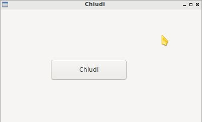
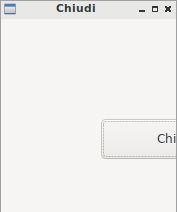
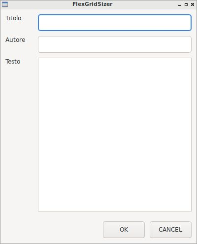
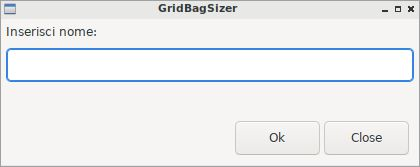

=================
Layout Management
=================

Il **layout management**, ovvero la gestione del posizionamento delle widget all'interno della finestra è l'arte di collocare gli oggetti tramite strumenti
che permettano un posizionamento semplice e allo stesso tempo all'applicazione di avere elasticità nei movimenti e nei ridimensionamenti.

Invece di chiacchierare oltre, partiamo con un esempio: ricordate la solita finestrella con pulsante chiudi collegato in un certo punto con una certa dimensione?
Bene! Vi ripropongo il codice che abbiamo già visto un paio di volte:

.. code:: python

    import wx

    class Esempio(wx.Frame):
        
        def __init__(self):
            super().__init__(None, title="Chiudi")
            pannello = wx.Panel(self)
            self.pulsante = wx.Button(pannello, label="Chiudi", pos=(5,5), size=(150,40))
            self.pulsante.Bind(wx.EVT_BUTTON, self.chiudiFinestra)
            
        def chiudiFinestra(self, event):
            self.Close(True)

    # ----------------------------------------
    app = wx.App()

    window = Esempio()
    window.Show()

    app.MainLoop()

Ok... questa è l'immagine della finestra creata con questo codice:

Bene, adesso invece di cliccare sul pulsante prova a ridimensionare la finestra più possibile... visto cosa succede? Il pulsante viene coperto completamente 
dalla finestra contenitrice!!

Infatti con il posizionamento assoluto, ovvero inserendo le widget con *pos* e *size*, il contenitore (ovvero la finestra con bordo) non ha bene idea di dove 
la widget finisca. Immaginate una finestra con parecchie widget, un disastro!!

Per implementare correttamente un layout in wxPython dobbiamo ricorrere ai **contenitori di ridimensionamento (sizers)**!!! La libreria wxPython offre i seguenti
oggetti per gestire il layout:

=================  ================================================================
Sizer              Descrizione
=================  ================================================================
wx.BoxSizer        Contenitore per una riga (o una colonna) di widget
wx.StaticBoxSizer  Come il Box Sizer ma con un contorno evidenziato (una StaticBox)
wx.GridSizer       Contenitore a tabella per le widget
wx.FlexGridSizer   Contenitore a tabella per le widget con dimensioni variabili
wx.GridBagSizer    Contenitore a tabella con spanning
=================  ================================================================

wx.BoxSizer
===========

box = wx.BoxSizer( ORIENTAZIONE )   può essere wx.HORIZONTAL oppure wx.VERTICAL

box.Add(widget, proportion = 0, flag = 0, border = 0)

proportion può essere 0,1,2
flag può essere...
border è la distanza in pixel fra le widget nella direzione indicata in flag

.. image:: images/wxBoxSizerLayout.jpg

.. code:: python

    import wx

    class Esempio(wx.Frame):
        
        def __init__(self):
            super().__init__(None, title="Prova layout con BoxSizer")
            
            panel = wx.Panel(self)
            vbox = wx.BoxSizer(wx.VERTICAL)
            
            hbox1 = wx.BoxSizer(wx.HORIZONTAL)
            self.st1 = wx.StaticText(panel, label="Cerca: ")
            self.tc1 = wx.TextCtrl(panel)
            hbox1.Add(self.st1, flag=wx.RIGHT, border=10)
            hbox1.Add(self.tc1, proportion=1)
            vbox.Add(hbox1,flag=wx.EXPAND|wx.ALL, border=10)
            
            vbox.Add((-1, 10))  # spazio verticale di 10 pixel
            
            hbox2 = wx.BoxSizer(wx.HORIZONTAL)
            self.st2 = wx.StaticText(panel, label="Risultati della ricerca")
            hbox2.Add(self.st2)
            vbox.Add(hbox2,flag=wx.EXPAND|wx.LEFT, border=10)
        
            hbox3 = wx.BoxSizer(wx.HORIZONTAL)
            self.tc2 = wx.TextCtrl(panel, style=wx.TE_MULTILINE)
            hbox3.Add(self.tc2, proportion=1, flag=wx.EXPAND)
            vbox.Add(hbox3,proportion=1,flag=wx.EXPAND|wx.ALL, border=10)

            vbox.Add((-1, 10))  # spazio verticale di 10 pixel

            hbox4 = wx.BoxSizer(wx.HORIZONTAL)
            self.ok = wx.Button(panel, label="OK")
            self.cancel = wx.Button(panel, label="CANCEL")
            hbox4.Add(self.ok, flag=wx.LEFT, border=10)
            hbox4.Add(self.cancel, flag=wx.LEFT, border=10)
            vbox.Add(hbox4,flag=wx.ALIGN_RIGHT|wx.RIGHT|wx.BOTTOM,border=10)

            panel.SetSizer(vbox)
            self.Centre()

    # ----------------------------------------
    app = wx.App()
    window = Esempio()
    window.Show()
    app.MainLoop()

wx.StaticBoxSizer
=================

Lo StaticBoxSizer è esattamente identico al BoxSizer se non per il fatto di inserire un rettangolo decorativo per evidenziare il layout creato.
Negli esempi relativi al BoxSizer provate a cambiarne qualcuno con uno StaticBoxSizer per apprezzare la differenza. E poi passate al prossimo layout!

wx.GridSizer
============

wx.GridSizer(rows = 1, cols = 0, vgap = 0, hgap = 0)

Problema di AddMany

.. image:: images/wxGridSizerLayout.jpg

.. code:: python

    import wx

    class Esempio(wx.Frame):
        
        def __init__(self):
            super().__init__(None, title="GridSizer")
            
            panel = wx.Panel(self)
            vbox = wx.BoxSizer(wx.VERTICAL)
            
            hbox1 = wx.BoxSizer(wx.HORIZONTAL)
            self.line = wx.TextCtrl(panel)
            hbox1.Add(self.line, proportion=1)
            vbox.Add(hbox1,flag=wx.EXPAND|wx.ALL, border=10)
            
            vbox.Add((-1, 10))  # spazio verticale di 10 pixel
            
            grid = wx.GridSizer(rows=4, cols=4, vgap=10, hgap=10)
            self.labels = "789/456*123-.0=+"
            self.buttons = []
            many = []
            for l in self.labels:
                btn = wx.Button(panel, label=l)
                self.buttons.append(btn)
                many.append( (btn,0,wx.EXPAND) )  
            grid.AddMany(many)
            vbox.Add(grid,flag=wx.EXPAND|wx.ALL, border=10)
            
            panel.SetSizer(vbox)
            self.Centre()
            
    # ----------------------------------------
    app = wx.App()
    window = Esempio()
    window.Show()
    app.MainLoop()

wx.FlexGridSizer
================

wx.FlexGridSizer(rows = 1, cols = 0, vgap = 0, hgap = 0)

.. code:: python

    import wx

    class Esempio(wx.Frame):
        
        def __init__(self):
            super().__init__(None, title="FlexGridSizer")
            
            panel = wx.Panel(self)
            box = wx.BoxSizer(wx.VERTICAL)
            
            flex = wx.FlexGridSizer(rows=3, cols=2, vgap=10, hgap=25)
            
            titolo = wx.StaticText(panel, label="Titolo")
            flex.Add(titolo)
            
            tcTitle = wx.TextCtrl(panel)
            flex.Add(tcTitle, 1, wx.EXPAND)
            
            autore = wx.StaticText(panel, label="Autore")
            flex.Add(autore)
            
            tcAuthor = wx.TextCtrl(panel)
            flex.Add(tcAuthor, 1, wx.EXPAND)
            
            testo = wx.StaticText(panel, label="Testo")
            flex.Add(testo)
            
            tcLyric = wx.TextCtrl(panel, style=wx.TE_MULTILINE)
            flex.Add(tcLyric, 1, wx.EXPAND)

            flex.AddGrowableRow(2, 1)
            flex.AddGrowableCol(1, 1)
            box.Add(flex, proportion=1, flag=wx.ALL|wx.EXPAND, border=10)
            
            box.Add((-1, 10))  # spazio verticale di 10 pixel

            hbox = wx.BoxSizer(wx.HORIZONTAL)
            self.ok = wx.Button(panel, label="OK")
            self.cancel = wx.Button(panel, label="CANCEL")
            hbox.Add(self.ok, flag=wx.LEFT, border=10)
            hbox.Add(self.cancel, flag=wx.LEFT, border=10)
            box.Add(hbox,flag=wx.ALIGN_RIGHT|wx.RIGHT|wx.BOTTOM,border=10)

            panel.SetSizer(box)
            self.Centre()
            
    # ----------------------------------------
    app = wx.App()
    window = Esempio()
    window.Show()
    app.MainLoop()

wx.GridBagSizer
===============

.. code:: python

    import wx

    class Esempio(wx.Frame):
        
        def __init__(self):
            super().__init__(None, title="GridBagSizer")
            
            panel = wx.Panel(self)
            bag = wx.GridBagSizer(4,4)
            
            text = wx.StaticText(panel, label="Inserisci nome: ")
            bag.Add(text, pos=(0,0), flag=wx.TOP|wx.LEFT|wx.BOTTOM, border=5)

            tc = wx.TextCtrl(panel)
            bag.Add(tc, pos=(1,0), span=(1,5), flag=wx.EXPAND|wx.LEFT|wx.RIGHT, border=5)

            buttonOk = wx.Button(panel, label="Ok")
            buttonClose = wx.Button(panel, label="Close")
            bag.Add(buttonOk, pos=(3,3))
            bag.Add(buttonClose, pos=(3,4), flag=wx.RIGHT|wx.BOTTOM, border=10)
            
            bag.AddGrowableCol(1)
            bag.AddGrowableRow(2)
            panel.SetSizer(bag)
            self.Centre()
            
    # ----------------------------------------
    app = wx.App()
    window = Esempio()
    window.Show()
    app.MainLoop()

