==========
Le widgets
==========

.. warning::
    Negli esempi che seguono, scritti con l'unico obiettivo di presentare le widget, andremo a posizionare più oggetti
    nella stessa finestra tramite il cosiddetto **posizionamento assoluto**, inserendo tutte le widget in un **wx.Panel** e
    indicando **posizione (pos)** e **dimensione (size)** degli oggetti.

    Questo modo di fare, pur semplice e intuitivo, è comunque assolutamente sconsigliato e sarà sostituito nel prossimo capitolo 
    da un concetto molto più avanzato e funzionale.

In questa sezione andremo ad inserire le Widgets più semplici, per capire come sono fatte e come funzionano. Per ognuna di esse sarà proposta
una descrizione sommaria delle sue caratteristiche, un'immagine esplicativa e un semplice esempio di codice per testare il funzionamento di base.

Ricordo che la documentazione completa di ognuna di queste widget è disponibile nella apposita sezione.

wx.Frame
========

La classe wx.Frame rappresenta una finestra vuota, con bordo e aspetto nativo nel sistema operativo ospite, con le funzionalità tipiche delle finestre già
implementate e funzionanti senza fare nulla: trascinamento, ridimensionamento, barra del titolo, riduzione ad icona, massimizzazione, etc...

.. image:: images/wxFrame.jpg

Non c'è molto da spiegare su questo che non abbiamo già visto... provate a copiare l'esempio sotto e a giocare un pò con la finestra. Poi magari date un occhio
alla documentazione.

.. code:: python

    import wx

    app = wx.App()
    win = wx.Frame(None, title="Un Esempio con wx.Frame")
    win.Show()
    app.MainLoop()

wx.Panel
========

La classe wx.Panel rappresenta una widget vuota, adatta ad essere utilizzata come contenitore delle altre che vedremo. Ha lo stesso colore di sfondo della
classe wx.Frame quindi è impossibile distinguere visivamente un Frame con dentro un Panel da uno senza.

La sua utilità sta nel fatto che fornisce nativamente interazione con la tastiera (*Tab Traversal*, lo spostamento fra una widget e l'altra premendo Tab)
per sè e per tutte le widget al suo interno.

.. TODO approfitta per background e introdurre i colori

wx.Button
=========

La classe wx.Button rappresenta una widget che implementa un pulsante cliccabile con una etichetta di testo dentro.

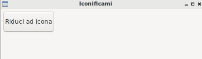

Nell'esempio proposto quando si clicca il pulsante (evento **wx.EVT_BUTTON**) si riduce ad icona l'applicazione.

.. code:: python

    import wx

    class Esempio(wx.Frame):
        
        def __init__(self):
            super().__init__(None, title="Iconificami")
            pannello = wx.Panel(self)
            self.pulsante = wx.Button(pannello, label="Riduci ad icona", pos=(5,5), size=(150,40))
            self.pulsante.Bind(wx.EVT_BUTTON, self.iconifica)
            
        def iconifica(self, evt):
            self.Iconize()

    # ----------------------------------------
    if __name__ == "__main__":
        app = wx.App()
        window = Esempio()
        window.Show()
        app.MainLoop()

    
wx.ToggleButton
===============

La classe wx.ToggleButton rappresenta una widget che implementa un pulsante con due stati: cliccato e non cliccato.

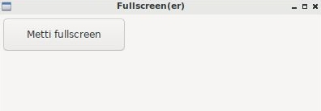

Nell'esempio proposto quando si clicca il ToggleButton (evento **wx.EVT_TOGGLEBUTTON**) si mette a schermo intero la finestra
e si cambia la scritta sul pulsante (che rimane cliccato). Cliccandolo di nuovo si ritorna alla situazione iniziale.

.. code:: python

    import wx

    class Esempio(wx.Frame):
        
        def __init__(self):
            super().__init__(None, title="Fullscreen(er)")
            pannello = wx.Panel(self)
            self.fsButton = wx.ToggleButton(pannello, label="Metti fullscreen", pos=(5,5), size=(150,40))
            self.fsButton.Bind(wx.EVT_TOGGLEBUTTON, self.mettiFullScreen)
            
        def mettiFullScreen(self, evt):
            if not self.IsFullScreen():
                self.ShowFullScreen(True)
                self.fsButton.SetLabel("Esci dal fullscreen")
            else:
                self.ShowFullScreen(False)
                self.fsButton.SetLabel("Metti fullscreen")

    # ----------------------------------------
    if __name__ == "__main__":
        app = wx.App()
        window = Esempio()
        window.Show()
        app.MainLoop()

    
wx.StaticText
=============

La classe wx.StaticText rappresenta una widget che implementa una etichetta dove il programmatore può inserire un testo da visualizzare all'utente.

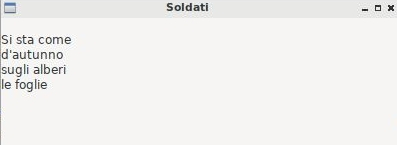

Nel semplicissimo esempio proposto, viene utilizzato la widget wx.StaticText per visualizzare una poesia in più righe. La widget è inserita a "tutta finestra".

.. code:: python

    import wx

    class Esempio(wx.Frame):
        
        def __init__(self):
            super().__init__(None, title="Soldati")
            testo = "\nSi sta come\nd'autunno\nsugli alberi\nle foglie\n"
            self.etichetta = wx.StaticText(self, label=testo)

    # ----------------------------------------
    if __name__ == "__main__":
        app = wx.App()
        window = Esempio()
        window.Show()
        app.MainLoop()

wx.StaticLine
=============

La classe wx.StaticLine rappresenta una widget che implementa una linea decorativa, orizzontale o verticale.

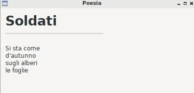

Inserire una wx.StaticLine è veramente semplice e serve solo a scopo decorativo. Approfitto di questa per farvi vedere come modificare il font 
di una wx.StaticText e realizzare una widget con titolo, linea e testo, come vedete nella figura.

.. code:: python

    import wx

    class Esempio(wx.Frame):
        
        def __init__(self):
            super().__init__(None, title="Poesia")
            pannello = wx.Panel(self)
            
            font = wx.Font(20,wx.DEFAULT,wx.NORMAL,wx.BOLD)
            self.titolo = wx.StaticText(pannello, label="Soldati",pos=(10,10), size=(200,30))
            self.titolo.SetFont(font)
            
            wx.StaticLine(pannello, pos=(10,50), size=(200,3))
            
            testo = "\nSi sta come\nd'autunno\nsugli alberi\nle foglie\n"
            self.etichetta = wx.StaticText(pannello, label=testo, pos=(10,60), size=(200,100))
        
    # ----------------------------------------
    if __name__ == "__main__":
        app = wx.App()
        window = Esempio()
        window.Show()
        app.MainLoop()

    

wx.TextCtrl
===========

La classe wx.TextCtrl rappresenta una widget che implementa una casella di testo, con vari stili supportati, definibili in fase di inizializzazione:

.. code:: python

    casella = wx.TextCtrl( window , style=OPTIONS )

    
Cito qui i più importanti:

=================== ==================================================
Stile               Descrizione
=================== ==================================================
(default)           Linea singola di testo, digitabile dall'utente
wx.TE_MULTILINE     Permette alla TextCtrl di utilizzare più righe
wx.TE_PASSWORD      Ogni carattere viene visualizzato con un asterisco
wx.TE_READONLY      Testo non modificabile dall'utente
wx.TE_PROCESS_ENTER Gestisce il tasto INVIO come evento separato
=================== ==================================================

Non ha un evento di default, ma ben due utilizzabili distintamente:

* **wx.EVT_TEXT**: viene scatenato ogni volta che cambia il testo contenuto nella widget

* **wx.EVT_TEXT_ENTER**: viene scatenato quando hai impostato lo stile wx.TE_PROCESS_ENTER e si preme INVIO nella widget

Nell'esempio proposto ho inserito una TextCtrl con caratteri oscurati (password). Man mano che si digita su di essa, il testo appare nella StaticText a fianco.
Provate a testare l'esempio autonomamente e a modificare il codice per visualizzare ciò che è stato digitato solo alla fine, quando si preme INVIO
nella TextCtrl.

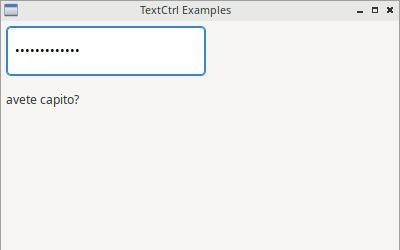

.. code:: python

    import wx

    class Esempio(wx.Frame):
        
        def __init__(self):
            super().__init__(None, title="TextCtrl Examples")
            panel = wx.Panel(self)
            
            self.text1 = wx.TextCtrl(panel, style=wx.TE_PASSWORD, pos=(5,5), size=(200,50))
            self.static1 = wx.StaticText(panel, label="", pos=(5,70))
            self.text1.Bind(wx.EVT_TEXT, self.aggiornaTesto)
            
        def aggiornaTesto(self, evt):
            self.static1.SetLabel( self.text1.GetValue() )
            return
        
    # ----------------------------------------
    if __name__ == "__main__":
        app = wx.App()
        window = Esempio()
        window.Show()
        app.MainLoop()

wx.ComboBox
===========

La classe wx.ComboBox rappresenta una widget che implementa un menù a tendina

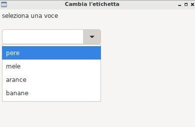

Nell'esempio proposto vediamo una etichetta e un menù a tendina. Selezionando una voce del menù a tendina (evento **wx.EVT_COMBOBOX**) si modifica il contenuto
dell'etichetta.

.. code:: python

    import wx

    class Esempio(wx.Frame):
        
        def __init__(self):
            super().__init__(None, title="Cambia l'etichetta")
                
            pannello = wx.Panel(self)       
            self.etichetta = wx.StaticText(pannello, label="seleziona una voce",
                                            pos=(5,5), size=(200,30))
            frutta = ["pere", "mele", "arance", "banane"]
            self.combo = wx.ComboBox(pannello, choices=frutta, style=wx.CB_READONLY,
                                            pos=(5,40), size=(200,30))
            self.combo.Bind(wx.EVT_COMBOBOX, self.visualizzaSelezione)
    
        def visualizzaSelezione(self, evt):
            f = evt.GetString()
            self.etichetta.SetLabel("Hai selezionato: " + f)
            return
        
    # ----------------------------------------
    if __name__ == "__main__":
        app = wx.App()
        window = Esempio()
        window.Show()
        app.MainLoop()

wx.CheckBox
===========

La classe wx.CheckBox rappresenta una widget che implementa una casella di spunta.

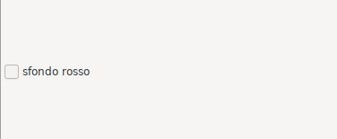

Nell'esempio proposto abbiamo una sola casella di spunta che quando viene abilitata imposta lo sfondo rosso della finestra, riportando
quello originale se deselezionata.

.. code:: python

    import wx

    class Esempio(wx.Frame):
        
        def __init__(self):
            super().__init__(None, title="Cambia il colore di sfondo")
            
            self.color = self.GetBackgroundColour()
            
            self.check = wx.CheckBox(self, label="sfondo rosso")
            self.check.Bind(wx.EVT_CHECKBOX, self.cambiaSfondo)
            
        def cambiaSfondo(self, evt):
            if self.check.GetValue():
                self.SetBackgroundColour("red")
            else:
                self.SetBackgroundColour(self.color)
            return
        
    # ----------------------------------------
    if __name__ == "__main__":
        app = wx.App()
        window = Esempio()
        window.Show()
        app.MainLoop()

    

wx.RadioButton
==============

La classe wx.RadioButton rappresenta una widget che implementa un pulsante selezionabile in maniera mutualmente esclusiva.

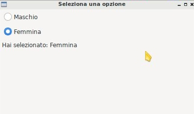

Per definire il comportamento tipico dei RadioButton della mutua esclusività si deve dichiarare nella prima widget lo stile **wx.RB_GROUP**:
tutte le RadioButton seguenti faranno parte del gruppo del primo. Se si vuole iniziare un nuovo gruppo, basterà inserire di nuovo lo stile necessario.

Nell'esempio proposto saranno inserite 2 radio buttons per selezionare il sesso (M/F). Al click su una di loro (evento **wx.EVT_RADIOBUTTON**) l'altra
si deselezionerà automaticamente e l'etichetta sotto verrà aggiornata.

.. code:: python

    import wx

    class Esempio(wx.Frame):
        
        def __init__(self):
            super().__init__(None, title="Seleziona una opzione")
            pannello = wx.Panel(self)
        
            self.rbM = wx.RadioButton(pannello, label="Maschio", style=wx.RB_GROUP, pos=(5,5))
            self.rbF = wx.RadioButton(pannello, label="Femmina", pos=(5,35))
            self.testo = wx.StaticText(pannello, label="Voce selezionata: Maschio", pos=(5,65))
            
            self.rbM.Bind(wx.EVT_RADIOBUTTON, self.impostaSesso)
            self.rbF.Bind(wx.EVT_RADIOBUTTON, self.impostaSesso)
            
        def impostaSesso(self, evt):
            if self.rbM.GetValue():
                self.testo.SetLabel("Hai selezionato: Maschio")
            else:
                self.testo.SetLabel("Hai selezionato: Femmina")
            return
    
    # ----------------------------------------
    if __name__ == "__main__":
        app = wx.App()
        window = Esempio()
        window.Show()
        app.MainLoop()

wx.Slider
=========

La classe wx.Slider rappresenta una widget che implementa un cursore ad avanzamento lineare.

.. image:: images/wxSlider.jpg

Nell'esempio proposto ho implementato uno slider che va da 0 a 100 (senza fare nulla: sono i valori di default) e ho impostato il valore
iniziale a 50. Sotto c'è una etichetta che si aggiorna automaticamente quando si muove lo slider (evento **wx.EVT_SLIDER**)

.. code:: python

    import wx

    class Esempio(wx.Frame):
        
        def __init__(self):
            super().__init__(None, title="Muovi lo slider")
            pannello = wx.Panel(self)
            self.slide = wx.Slider(pannello, value=50, pos=(5,5), size=(250,-1))
            self.testo = wx.StaticText(pannello, label="Valore: 50", pos=(5,35))
            
            self.slide.Bind(wx.EVT_SLIDER, self.aggiornaValore)
            
        def aggiornaValore(self, evt):
            v = self.slide.GetValue()
            self.testo.SetLabel("Valore: " + str(v))
            return
        
    # ----------------------------------------
    if __name__ == "__main__":
        app = wx.App()
        window = Esempio()
        window.Show()
        app.MainLoop()

wx.SpinCtrl
===========

La classe wx.SpinCtrl rappresenta una widget che implementa un selettore numerico con pulsanti di avanzamento.

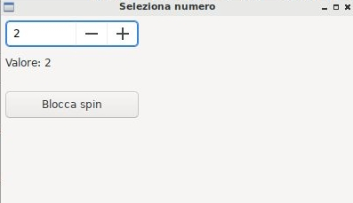

Nell'esempio proposto quando muovo il controllo della wx.SpinCtrl l'etichetta si aggiorna automaticamente (evento **wx.EVT_SPINCTRL**). 
Come ormai tradizione in questi esempi, approfitto di una widget *facile* per introdurre una piccola novità: Il pulsante a due stati
serve per abilitare e disabilitare la widget. Provate!

.. code:: python

    import wx

    class Esempio(wx.Frame):
        
        def __init__(self):
            super().__init__(None, title="Seleziona numero")
            pannello = wx.Panel(self)
            self.spin = wx.SpinCtrl(pannello, value="0", pos=(5,5), size=(150,30))
            self.spin.SetRange(-10,10)
            self.testo = wx.StaticText(pannello, label="Valore: 0", pos=(5,45), size=(150,30))
            self.pulsante = wx.ToggleButton(pannello, label="Blocca spin", pos=(5,85), size=(150,30))
            
            self.spin.Bind(wx.EVT_SPINCTRL, self.aggiornaValore)
            self.pulsante.Bind(wx.EVT_TOGGLEBUTTON, self.bloccaSpinCtrl)
                    
        def aggiornaValore(self, evt):
            v = self.spin.GetValue()
            self.testo.SetLabel("Valore: " + str(v))
            return
        
        def bloccaSpinCtrl(self, evt):
            if self.pulsante.GetValue():
                self.spin.Enable(False)
                self.pulsante.SetLabel("Sblocca")
            else:
                self.spin.Enable(True)        
                self.pulsante.SetLabel("Blocca spin")
            return
        
    # ----------------------------------------
    if __name__ == "__main__":
        app = wx.App()
        window = Esempio()
        window.Show()
        app.MainLoop()

wx.StaticBox
============

La classe wx.StaticBox rappresenta una widget che implementa una decorazione per raggruppare le widget. Utile per organizzare il layout.

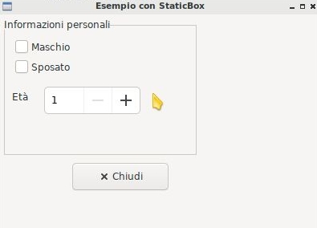

Nell'esempio proposto vediamo come la StaticBox, con etichetta "Informazioni Personali" serva a raggruppare logicamente le widget che permettono
all'utente di inserirli. Non sapendo ancora organizzare un layout (lo vedremo a breve!!!) voglio farvi notare che gli oggetti sono *dentro* la StaticBox
solo perché a livello di dimensione essa riesce a contenerli tutti tranne il pulsante in fondo!!!

Provate a giovare un pò con i valori del parametro size per rendervene conto.

.. code:: python

    import wx

    class Esempio(wx.Frame):
        
        def __init__(self):
            super().__init__(None, title="Esempio con StaticBox")
            pnl = wx.Panel(self)
            self.box = wx.StaticBox(pnl, label='Informazioni personali', pos=(5, 5), size=(240, 170))
            self.sex = wx.CheckBox(pnl, label='Maschio', pos=(15, 30))
            self.married = wx.CheckBox(pnl, label='Sposato', pos=(15, 55))
            self.text = wx.StaticText(pnl, label='Età', pos=(15, 95))
            self.age = wx.SpinCtrl(pnl, value='1', pos=(55, 90), size=(120, -1), min=1, max=120)
            
            self.button = wx.Button(pnl, wx.ID_CLOSE, pos=(90, 185), size=(120, -1))
            self.button.Bind(wx.EVT_BUTTON, self.chiudi)
                    
        def chiudi(self, evt):    
            self.Close()
            return
        
    # ----------------------------------------
    if __name__ == "__main__":
        app = wx.App()
        window = Esempio()
        window.Show()
        app.MainLoop()

    

wx.ListBox
==========

La classe wx.ListBox rappresenta una widget che implementa una lista di voci selezionabili in maniera singola o multipla.

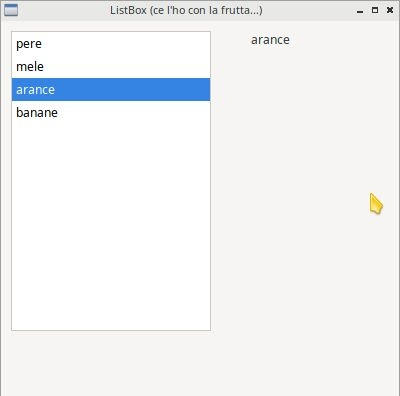

Questa widget supporta 2 eventi considerabili \"di default\":

* **wx.EVT_LISTBOX**: scatenato quando si seleziona un elemento della lista

* **wx.EVT_LISTBOX_DCLICK**: scatenato quando si fa doppio click su un elemento della lista

Come al solito vediamo il codice che genera l'immagine che vedete sopra:

.. code:: python

    import wx

    class Esempio(wx.Frame):
        
        def __init__(self):
            super().__init__(None, title="ListBox (ce l'ho con la frutta...)")
            pannello = wx.Panel(self)
            frutta = ["pere", "mele", "arance", "banane"]
            self.list = wx.ListBox(pannello, choices=frutta, pos=(10,10), size=(200,300))
            self.etichetta = wx.StaticText(pannello, pos=(250,10), size=(200,50))
            self.list.Bind(wx.EVT_LISTBOX, self.updateLabel)
            
        def updateLabel(self, evt):
            index = self.list.GetSelection()
            self.etichetta.SetLabel( self.list.GetString(index) )
            return
        
    # ----------------------------------------
    if __name__ == "__main__":
        app = wx.App()
        window = Esempio()
        window.Show()
        app.MainLoop()

Provate a cambiare l'evento nel Bind per vedere la differenza di funzionamento.

