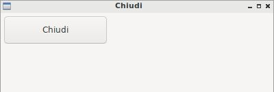
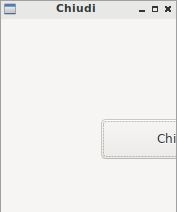
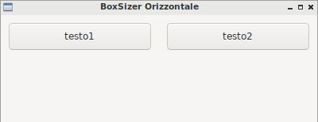
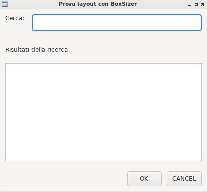
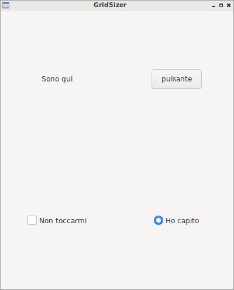
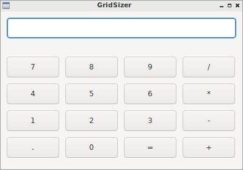
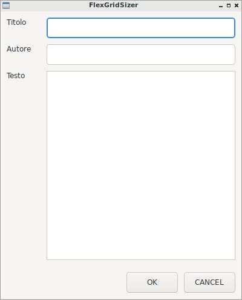
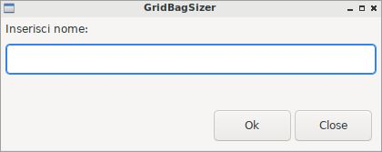

===================
Gestione del Layout
===================

Il **layout management**, ovvero la gestione del posizionamento delle widget all'interno della finestra è l'arte di collocare gli oggetti tramite strumenti
che permettano un posizionamento semplice e allo stesso tempo all'applicazione di avere elasticità nei movimenti e nei ridimensionamenti.

Invece di chiacchierare oltre, partiamo con un esempio: ricordate la solita finestrella con pulsante chiudi collegato in un certo punto con una certa dimensione?
Bene! Vi ripropongo il codice che abbiamo già visto un paio di volte:

.. code:: python

    import wx

    class Esempio(wx.Frame):
        
        def __init__(self):
            super().__init__(None, title="Chiudi")
            pannello = wx.Panel(self)
            self.pulsante = wx.Button(pannello, label="Chiudi", pos=(100,100), size=(150,40))
            self.pulsante.Bind(wx.EVT_BUTTON, self.chiudiFinestra)
            
        def chiudiFinestra(self, event):
            self.Close(True)

    # ----------------------------------------
    app = wx.App()

    window = Esempio()
    window.Show()

    app.MainLoop()

Ok... questa è l'immagine della finestra creata con questo codice:

Bene, adesso invece di cliccare sul pulsante provate a ridimensionare la finestra... visto cosa succede? Il pulsante rimane fermo nella sua posizione
senza ridimensionarsi o *spostarsi* minimamente e viene presto coperto dalla finestra contenitrice, anche se avrebbe spazio a sinistra per rendersi visualizzabile.

Infatti con il posizionamento assoluto, ovvero inserendo le widget con *pos* e *size*, il contenitore (ovvero la finestra con bordo) non ha voce in capitolo
sul posizionamento delle widget contenute. Immaginate una finestra con parecchie widget, un disastro!!

Per implementare correttamente un layout in wxPython dobbiamo ricorrere ai **contenitori di ridimensionamento (sizers)**!!!  Questi oggetti (non grafici) possono contenere
oggetti grafici secondo una disposizione a fila o a griglia e organizzano la dimensione del contenente (tipicamente la finestra o il pannello) in base alle dimensioni
del contenuto (tipicamente... le widgets). Questi contenitori presentano una serie di caratteristiche comuni:

* **Una dimensione minima**: che è tipicamente identica alla dimensione iniziale delle widget contenute in esso ma che può essere esplicitata 
  dal programmatore tramite codice.

* **Un bordo**: uno spazio vuoto utile solo a distanziare minimamente le widgets dal bordo reale del contenitore (la finestra o altro). 
  Il programmatore ha pieno controllo di esso nelle quattro direzioni.

* **Un allineamento**: questo è tipicamente il compito principale del sizer. Ogni sizer induce un allineamento caratteristico. 
  Li vedremo nel dettaglio studiandoli uno ad uno.

* **Un fattore di allungamento**: una caratteristica che controlla il ridimensionamento delle widgets quando viene ridimensionato il loro contenitore. 
  Cosa succede se aumentiamo la larghezza di una finestra in cui abbiamo oggetti gestiti da un sizer? Questo parametro regola il comportamento degli stessi in questo caso.

La libreria wxPython offre i seguenti oggetti per gestire il layout:

=================  ================================================================
Sizer              Descrizione
=================  ================================================================
wx.BoxSizer        Contenitore per una riga (o una colonna) di widget
wx.StaticBoxSizer  Come il Box Sizer ma con un contorno evidenziato (una StaticBox)
wx.GridSizer       Contenitore a tabella per le widget
wx.FlexGridSizer   Contenitore a tabella per le widget con dimensioni variabili
wx.GridBagSizer    Contenitore a tabella con spanning
=================  ================================================================

Prima di iniziare a preoccuparvi, sappiate che i contenitori sono solo di 2 tipi:

#. **Contenitori a fila** , come il Sizer **wx.BoxSizer** che può essere impostato in senso orizzontale oppure verticale o come **wx.StaticBoxSizer**, che funziona
   esattamente come il precedente con la differenza di avere un contorno evidenziato intorno: un abbellimento e nulla più.
   
#. **Contenitori a griglia**, che determinano una organizzazione tabellare (pensate ad una calcolatrice, o a un form da compilare). Il primo, **wx.GridSizer** è
   quello più semplice; gli altri due aggiungono alcune caratteristiche avanzate di cui ci renderemo conto negli esempi sotto.

Ok, proviamo a vedere come funziona ognuno di questi, partendo dalle loro caratteristiche e vedendoli all'opera con qualche esempio di codice.

BoxSizer
========

La classe wx.BoxSizer può essere utilizzata per creare un layout orizzontale oppure verticale.

.. code:: python

    # se vuoi un layout orizzontale
    hBox = wx.BoxSizer( wx.HORIZONTAL )   

    # se vuoi un layout verticale
    vBox = wx.BoxSizer( wx.VERTICAL )   

E fino a qui è molto semplice.

Per aggiungere widget al layout bisogna utilizzare la funzione *Add* che presenta una serie di opzioni che determinano come le widget si *allargheranno*
nello spazio disponibile e metteranno *bordo* fra di loro. Vediamo la sintassi:

.. code:: python

    box.Add(widget, proportion = 0, flag = 0, border = 0)

Vediamo i parametri:

* **widget** è la widget da inserire

* **proportion** può essere 0,1,2

    * 0 (valore di *default*, ma poco usato) significa che la widget non si ridimensionerà
    
    * 1 significa che la widget si ridimensionerà proporzionalmente al suo contenitore
    
    * 2 significa che la widget cercherà di occupare il doppio del posto di quelle con valore 1 :)

* **border** (anche se è l'ultimo lo metto prima, perché il prossimo è più lungo) rappresenta la dimensione in pixel del bordo della widget, 
  nelle direzioni indicate in flag (se non ci sono flag, è un parametro inutile).

* **flag** permette di inserire alcune informazioni su come la widget deve comportarsi **all'interno del layout**.

  La direzione verso cui avere bordo, che può essere:

    * wx.TOP: bordo verso l'alto
    
    * wx.RIGHT: bordo verso destra
    
    * wx.BOTTOM: bordo verso il basso
    
    * wx.LEFT: bordo verso sinistra
    
    * wx.ALL: bordo in tutte le direzione
    
  La direzione di allinamento della widget, che può essere:
  
    * wx.ALIGN_LEFT, allineata a sinistra
    
    * wx.ALIGN_RIGHT, allineata a destra
    
    * wx.ALIGN_TOP, incolonnata in alto
    
    * wx.ALIGN_BOTTOM, incolonnata in basso
    
    * wx.ALIGN_CENTER_VERTICAL, allinamento verticale al centro
    
    * wx.ALIGN_CENTER_HORIZONTAL, allinamento orizzontale al centro
    
    * wx.ALIGN_CENTER, al centro, verticalmente e orizzontalmente

  C'è inoltre un ultimo flag che permette alla widget di espandersi su tutto il posto disponibile (ma ovviamente funziona solo se proportion vale 1 o 2)
    
    * wx.EXPAND: widget in espansione all'aumentare dello spazio

  Va detto che è possibile combinare 2 o più flag con il simbolo `|` (si chiama *pipe*). Vediamo qualche esempio:
  

  .. code:: python

      # bordo in alto e a sinistra con la widget in espansione
      ... flag = wx.TOP | wx.LEFT | wx.EXPAND ... 
      
      # widget allineata a destra con 10 pixel di bordo
      ... flag = wx.ALIGN_RIGHT | wx.RIGHT, border = 10 )
    
  E così via...

Quando hai finito di lavorare con layout e widget devi applicare il layout al suo contenitore, che nei nostri esempi sarà sempre un pannello, quindi dovrai fare 
una cosa del genere:

.. code:: python

    # ...
    # per inserire il BoxSizer come layout del Panel
    panel.SetSizer(box)

Sembra complicato all'inizio, ma guardiamo qualche esempio e avremo tutto chiaro. 

Il prossimo codice crea un layout orizzontale con 2 pulsanti che vogliamo ridimensionarsi con la finestra (quindi *proportion = 1*) e con un pochino di bordo in tutte le direzioni.

.. code:: python

    import wx

    class Esempio(wx.Frame):
        
        def __init__(self):
            super().__init__(None, title="BoxSizer Orizzontale")
            panel = wx.Panel(self)
            box = wx.BoxSizer(wx.HORIZONTAL)
            self.p1 = wx.Button(panel, label="testo1")
            self.p2 = wx.Button(panel, label="testo2")
            
            # i 2 pulsanti si espandono allo stesso modo
            # e hanno 10 pixel di bordo (fisso) in tutte le direzioni.
            box.Add(self.p1, proportion=1, flag=wx.ALL, border=10)
            box.Add(self.p2, proportion=1, flag=wx.ALL, border=10)
            
            panel.SetSizer(box)
            self.Centre()

    # ----------------------------------------
    app = wx.App()
    window = Esempio()
    window.Show()
    app.MainLoop()

    
Il risultato del codice precedente è questo:

.. warning::
    Prima di andare avanti, proviamo a capire quello che abbiamo visto e fatto fino ad ora! Prova a fare le seguenti modifiche al codice precedente:

    * metti a 0 il valore di proportion di uno dei due pulsanti

    * metti a 2 il valore di proportion di uno dei due pulsanti

    * aggiungi wx.EXPAND ai flag dei pulsanti

    * modifica il valore del bordo per uno dei pulsanti.

    * togli wx.ALL dai flag e metti qualcuno degli altri flag disponibili

    Fatte queste prove potrai apprezzare meglio quanto appreso finora ;)

Il prossimo esempio è leggermente più complicato (soprattutto perché è più lungo): mette insieme vari layout orizzontali e verticali combinandoli
assieme fino ad ottenere ciò che vedete nella prossima immagine.

Si parte da un pannello e un layout verticale. Poi si crea man mano un layout orizzontale, si mettono le widget in esso e infine si inserisce il layout
orizzontale in quello verticale principale. Ad un certo punto ho aggiunto anche degli spazi, che ho spiegato con un commento.

.. code:: python

    import wx

    class Esempio(wx.Frame):
        
        def __init__(self):
            super().__init__(None, title="Prova layout con BoxSizer")
            
            panel = wx.Panel(self)
            vbox = wx.BoxSizer(wx.VERTICAL)
            
            hbox1 = wx.BoxSizer(wx.HORIZONTAL)
            self.st1 = wx.StaticText(panel, label="Cerca: ")
            self.tc1 = wx.TextCtrl(panel)
            hbox1.Add(self.st1, flag=wx.RIGHT, border=10)
            hbox1.Add(self.tc1, proportion=1)
            vbox.Add(hbox1,flag=wx.EXPAND | wx.ALL, border=10)
            
            vbox.Add((-1, 10))  # spazio verticale di 10 pixel, orizzontale nulla
            
            hbox2 = wx.BoxSizer(wx.HORIZONTAL)
            self.st2 = wx.StaticText(panel, label="Risultati della ricerca")
            hbox2.Add(self.st2)
            vbox.Add(hbox2,flag=wx.EXPAND | wx.LEFT, border=10)
        
            hbox3 = wx.BoxSizer(wx.HORIZONTAL)
            self.tc2 = wx.TextCtrl(panel, style=wx.TE_MULTILINE)
            hbox3.Add(self.tc2, proportion=1, flag=wx.EXPAND)
            vbox.Add(hbox3,proportion=1,flag=wx.EXPAND|wx.ALL, border=10)

            vbox.Add((-1, 10))  # spazio verticale di 10 pixel, orizzontale nulla

            hbox4 = wx.BoxSizer(wx.HORIZONTAL)
            self.ok = wx.Button(panel, label="OK")
            self.cancel = wx.Button(panel, label="CANCEL")
            hbox4.Add(self.ok, flag=wx.LEFT, border=10)
            hbox4.Add(self.cancel, flag=wx.LEFT, border=10)
            vbox.Add(hbox4,flag=wx.ALIGN_RIGHT | wx.RIGHT | wx.BOTTOM,border=10)

            panel.SetSizer(vbox)
            self.Centre()

    # ----------------------------------------
    app = wx.App()
    window = Esempio()
    window.Show()
    app.MainLoop()

Capisco perfettamente che non vi sentiate ancora in grado di implementare layout così complicati! Questo l'ho messo apposta perché possiate curiosare in 
questo codice quando vi troverete ad implementare qualcosa di simile (o magari poco più semplice... accadrà molto presto!!!).

StaticBoxSizer
==============

Lo StaticBoxSizer è esattamente identico al BoxSizer se non per il fatto che contiene al suo interno già una StaticBox per decorare ed evidenziare il layout creato.

A livello operativo bisogna dunque fornire, in fase di definizione, anche un genitore (per la StaticBox, solitamente un pannello) e il testo della stessa.

.. code:: python

    # se vuoi una BoxSizer
    box1 = wx.BoxSizer( wx.HORIZONTAL )

    # se vuoi una StaticBoxSizer
    box2 = wx.StaticBoxSizer( wx.HORIZONTAL, panel, "titolo" )

Negli esempi relativi al BoxSizer provate a cambiarne qualcuno con uno StaticBoxSizer per apprezzare la differenza. E poi passate al prossimo layout!

GridSizer
=========

La classe wx.GridSizer può essere utilizzata per creare un layout a griglia uniforme, ovvero con lo stesso spazio (più o meno) per tutte le caselle della griglia. Quando si definisce, è possibile anche specificare un margine orizzontale e verticale fra gli elementi della griglia.

.. code:: python

    wx.GridSizer(rows = 1, cols = 0, vgap = 0, hgap = 0)

    # esempio di layout a griglia con 4 righe e 3 colonne e 5 pixel di margine orizzontale e verticale
    grid = wx.GridSizer( rows = 4 , cols = 3, vgap = 5 , hgap = 5 )

    
Ok, adesso proviamo a guadagnare punti a favore della OOP. Come si fa ad aggiungere widgets ad un GridSizer? Esattamente con la stessa identica funzione. Perchè?
Beh... perché derivano entrambe dalla stessa classe (la classe **wx.Sizer**, che **non** studieremo) ed ereditano entrambe la funzione **Add**. Con che logica
vengono aggiunte le widget alla GridSizer tramite la funione Add? In fila, a partire da in alto a sinistra, poi si procede in riga e terminata la riga in alto si
continua sotto.

Alla luce delle nuove conoscenze acquisite, facciamo subito una prova semplice semplice:

.. code:: python

    import wx

    class Esempio(wx.Frame):
        
        def __init__(self):
            super().__init__(None, title="GridSizer")
            
            panel = wx.Panel(self)

            grid = wx.GridSizer(rows = 2, cols = 2, vgap = 10, hgap = 10)

            self.st = wx.StaticText(panel, label="Sono qui")
            self.bt = wx.Button(panel, label="pulsante")
            self.cb = wx.CheckBox(panel, label="Non toccarmi")
            self.rb = wx.RadioButton(panel, label="Ho capito")

            grid.Add(self.st, proportion=1, flag=wx.ALIGN_CENTER)
            grid.Add(self.bt, proportion=1, flag=wx.ALIGN_CENTER)
            grid.Add(self.cb, proportion=1, flag=wx.ALIGN_CENTER)
            grid.Add(self.rb, proportion=1, flag=wx.ALIGN_CENTER)

            panel.SetSizer(grid)
            self.Centre()
            
    # ----------------------------------------
    app = wx.App()
    window = Esempio()
    window.Show()
    app.MainLoop()

    
Risultato:

Come già sperimentato precedentemente, passiamo a visionare il codice e il risultato relativo ad un esempio un pochino più complicato, in cui il GridSizer
viene inserito dentro un layout verticale, fino a formare una pseudo calcolatrice.

.. code:: python

    import wx

    class Esempio(wx.Frame):
        
        def __init__(self):
            super().__init__(None, title="GridSizer")
            
            panel = wx.Panel(self)
            vbox = wx.BoxSizer(wx.VERTICAL)
            
            hbox1 = wx.BoxSizer(wx.HORIZONTAL)
            self.line = wx.TextCtrl(panel)
            hbox1.Add(self.line, proportion=1)
            vbox.Add(hbox1,flag=wx.EXPAND|wx.ALL, border=10)
            
            vbox.Add((-1, 10))  # spazio verticale di 10 pixel
            
            grid = wx.GridSizer(rows=4, cols=4, vgap=10, hgap=10)
            self.labels = "789/456*123-.0=+"
            self.buttons = {}
            many = []
            for lab in self.labels:
                btn = wx.Button(panel, label=lab)
                self.buttons[lab] = btn
                grid.Add(btn, proportion=0,flag=wx.EXPAND)

            vbox.Add(grid,flag=wx.EXPAND|wx.ALL, border=10)
            
            panel.SetSizer(vbox)
            self.Centre()
            
    # ----------------------------------------
    app = wx.App()
    window = Esempio()
    window.Show()
    app.MainLoop()

Copiate il codice, eseguite, dovreste vedere una window tipo questa.

Adesso però tornate su e ricontrollate il codice che avete copiato cercando di comprendere l'organizzazione del layout.

FlexGridSizer
=============

La classe wx.FlexGridSizer può essere utilizzata per creare un layout a griglia flessibile, ovvero con righe o colonne di dimensione diversa.
Questo può ritornare utile soprattutto in alcuni casi specifici, che vedremo fra un attimo.

La definizione di un FlexGridSizer è identica a quella di un GridSizer:

.. code:: python

    wx.FlexGridSizer(rows = 1, cols = 0, vgap = 0, hgap = 0)

    # esempio di layout a griglia flessibile con 4 righe e 3 colonne e 5 pixel di magine orizzontale e verticale
    grid = wx.FlexGridSizer( rows = 4 , cols = 3, vgap = 5 , hgap = 5 )

    
Quindi non c'è molto da spiegare: un FlexGridSizer si comporta esattamente come un GridSizer, se non fosse per la possibilità di dire ad una riga 
(o ad una colonna) di allargarsi secondo lo spazio disponibile. Lo stesso si potrebbe ottenere combinando BoxSizer orizzontale e verticale e lavorando 
con il parametro proportion, ma forse sarebbe più complicato e comunque sempre meno... *flessibile*.

Le funzioni per allargare righe e colonne sono rispettivamente:

.. code:: python

    # Permette di allungare una riga
    # Il primo parametro è il numero di riga (si inizia a contare da ZERO)
    # Il secondo è la solita proportion: mettete 1
    AddGrowableRow(row, proportion=0)
    
    # Permette di allungare una colonne
    # Il primo parametro è il numero di colonna (si inizia a contare da ZERO)
    # Il secondo è la solita proportion: mettete 1
    AddGrowableCol(1, proportion=1)
    

Nell'esempio che segue viene utilizzato un FlexGridSizer per permettere di allungare la seconda colonna e la terza riga

.. code:: python

    import wx

    class Esempio(wx.Frame):
        
        def __init__(self):
            super().__init__(None, title="FlexGridSizer")
            
            panel = wx.Panel(self)
            box = wx.BoxSizer(wx.VERTICAL)
            
            flex = wx.FlexGridSizer(rows=3, cols=2, vgap=10, hgap=25)
            
            titolo = wx.StaticText(panel, label="Titolo")
            flex.Add(titolo)
            
            tcTitle = wx.TextCtrl(panel)
            flex.Add(tcTitle, 1, wx.EXPAND)
            
            autore = wx.StaticText(panel, label="Autore")
            flex.Add(autore)
            
            tcAuthor = wx.TextCtrl(panel)
            flex.Add(tcAuthor, 1, wx.EXPAND)
            
            testo = wx.StaticText(panel, label="Testo")
            flex.Add(testo)
            
            tcLyric = wx.TextCtrl(panel, style=wx.TE_MULTILINE)
            flex.Add(tcLyric, 1, wx.EXPAND)

            flex.AddGrowableRow(2, proportion=1)
            flex.AddGrowableCol(1, proportion=1)
            box.Add(flex, proportion=1, flag=wx.ALL|wx.EXPAND, border=10)
            
            box.Add((-1, 10))  # spazio verticale di 10 pixel

            hbox = wx.BoxSizer(wx.HORIZONTAL)
            self.ok = wx.Button(panel, label="OK")
            self.cancel = wx.Button(panel, label="CANCEL")
            hbox.Add(self.ok, flag=wx.LEFT, border=10)
            hbox.Add(self.cancel, flag=wx.LEFT, border=10)
            box.Add(hbox,flag=wx.ALIGN_RIGHT|wx.RIGHT|wx.BOTTOM,border=10)

            panel.SetSizer(box)
            self.Centre()
            
    # ----------------------------------------
    app = wx.App()
    window = Esempio()
    window.Show()
    app.MainLoop()

GridBagSizer
============

La classe wx.GridBagSizer implementa il contenitore più flessibile in wxPython e un concetto analogo risulta presente in molti altri toolkit grafici: 
in questo Sizer infatti, le widget possono occupare qualunque posizione e comprendere anche più di una riga o una colonna.

Si definisce senza precisare il numero di righe e colonne, ma solo lo spazio fra queste:

.. code:: python

    wx.GridBagSizer( vgap , hgap )

In questo Sizer è stato reimplementato il metodo *Add*, l'unico utilizzabile per inserirvi elementi

.. code:: python

    bag = wx.GridBagSizer( 10, 10 )
    bag.Add ( widget , pos = (row,column) , span = wx.DefaultSpan, flag = 0, border = 0)
    
Vediamo i parametri:

* **widget** è la widget da inserire

* **pos** è la posizione della widget nella griglia. Ricordate che si inizia a contare da ZERO.

* **span** indica di quanto la widget si deve allargare. Di default occupa solo la sua casella. Prende una tupla 2D. Ad esempio inserendo span = (2,3) dite
  che la widget deve allargarsi di 2 righe e 3 colonne.
  
* **flag** e **border** sono gli stessi del solito.

Di default le caselle della griglia mantengono la loro proporzione se la finestra viene ridimensionata. Se volete invece fare in modo che una riga o una colonna si comporti come nel FlexGridSizer, usate i seguenti metodi:

.. code:: python

    bag = wx.GridBagSizer( 10, 10 )
    
    # ...
    # numero di riga
    bar.AddGrowableRow (row)
    # ...
    # numero di colonna
    bar.AddGrowableCol (col)

Per concludere arriviamo finalmente all'ultimo esempio con un layout GridBagSizer. In questo esempio l'idea è quella di realizzare una griglia di 3 righe per 5 colonne: le 3 righe sono evidenti nel disegno; nella prima riga è occupata solo la prima casella ( pos = (0,0) ); la seconda riga è tutta occupata da un'unica
widget; nella terza riga sono occupate dai pulsanti solo le ultime 2 caselle.

Ecco il codice che implementa quest'ultimo esempio:

.. code:: python

    import wx

    class Esempio(wx.Frame):
        
        def __init__(self):
            super().__init__(None, title="GridBagSizer")
            
            panel = wx.Panel(self)
            bag = wx.GridBagSizer(4,4)
            
            text = wx.StaticText(panel, label="Inserisci nome: ")
            bag.Add(text, pos=(0,0), flag=wx.TOP|wx.LEFT|wx.BOTTOM, border=5)

            tc = wx.TextCtrl(panel)
            bag.Add(tc, pos=(1,0), span=(1,5), flag=wx.EXPAND|wx.LEFT|wx.RIGHT, border=5)

            buttonOk = wx.Button(panel, label="Ok")
            buttonClose = wx.Button(panel, label="Close")
            bag.Add(buttonOk, pos=(3,3))
            bag.Add(buttonClose, pos=(3,4), flag=wx.RIGHT|wx.BOTTOM, border=10)
            
            bag.AddGrowableCol(1)
            bag.AddGrowableRow(2)
            panel.SetSizer(bag)
            self.Centre()
            
    # ----------------------------------------
    app = wx.App()
    window = Esempio()
    window.Show()
    app.MainLoop()

.. tip::
    Ok, state provando a creare un layout, partendo da una idea che avete e non state riuscendo... Ci sono due suggerimenti che posso darvi.
    
    Il primo è quello di disegnare **prima** su carta il layout che volete ottenere, in modo da poter ragionare su quale *Sizers* possono realizzarlo
    più correttamente.

    In questo modo dovreste riuscire ad avere l'idea giusta su come realizzare il layout. Poi scrivete il codice, lo testate... e non funziona ancora :(

    Il secondo suggerimento è quello di utilizzare uno strumento di debug, fornito direttamente da wxPython: **The Widget Inspection Tool (WIT)**.
    Ne parlo un pochino in questa pagina_

    Buona lettura!

.. _pagina: 293_tools_wit.html

Layout Sizing
=============

Per concludere il discorso del layout non posso non dedicare qualche riga al dimensionamento delle finestre. Niente di complicato, per carità... il ridimensionamento
iniziale di una widget dovrebbe essere gestito automaticamente (cioè... senza fare nulla) se il layout viene implementato correttamente. Anzi... quando la dimensione
iniziale non ci soddisfa, il più delle volte significa che abbiamo sbagliato qualche parametro nel layout!

Ci sono però alcune scelte (poche... tranquilli) che possiamo indurre tramite codice e che posso migliorare il comportamento della nostra finestra. Vediamole una per una!

**wx.Window.SetMinSize && wx.Window.SetMaxSize**

    Imposta la dimensione minima/massima della finestra. Funziona solo per il ridimensionamento manuale, perché il programmatore può comunque superare i limiti imposti 
    usando la funzione *SetSize*.
    Andrebbe chiamata *prima* di imporre un sizer (ovvero prima di SetSizer).
    
    Esempio banale:
    
    .. code:: python
    
        # ...
        self.SetMinSize( (400,250) )
        panel.SetSizer(vbox)
        # ...
    
**wx.Sizer.Fit(self, window) && wx.Window.SetSizerAndFit(wx.Sizer)**

    La funzione *Fit*, disponibile in tutti i sizer, dice al sizer di ridimensionare la finestra per aderire alla dimensione minima del sizer. Va ovviamente chiamata *dopo*
    aver impostato un sizer in una finestra con *SetSizer*.
    
    È possibile ovviare alla chiamata delle due funzioni consecutive inserendo il sizer nella finestra con *SetSizerAndFit*. Esempi banali:
    
    .. code:: python
    
        # ...
        # utilizza prima SetSizer e dopo Fit...
        panel.SetSizer(vbox)
        vbox.Fit(self)
        # ...
        # oppure insieme con SetSizerAndFit
        panel.SetSizerAndFit(vbox)
        # ...

Volendo approfondire il comportamento dei sizer nel ridimensionamento delle finestre vi consiglio di dare un occhio alle funzioni *wx.Window.ClientToWindowSize* 
e *wx.Window.WindowToClientSize*. 
In generale, c'è una parte specifica della documentazione a proposito di questo problema: https://docs.wxpython.org/window_sizing_overview.html

Se invece pensate sia sufficiente quello che avete visto qui... passate agli esercizi del prossimo capitolo!!!
