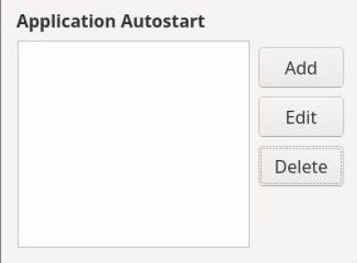

===================
Esercizi sul layout
===================

Alcuni esercizi in cui ricostruire il layout dell'immagine proposta.

Buon lavoro!

.. i numeri degli esercizi sono 18x

**Esercizio 181**

.. line::

**Esercizio 182**

.. line::

**Esercizio 183**

.. line::

**Esercizio 184**

.. line::

**Esercizio 185**

.. line::

**Esercizio 186**

.. line::
