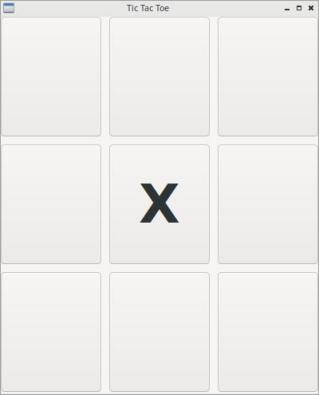
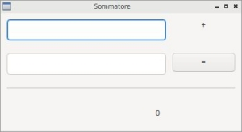
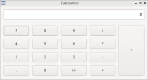
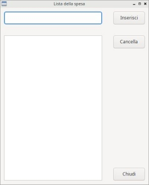

====================
Esercizi strutturati
====================

Negli esercizi che seguono dovete implementare layout e funzionalità: nessuno di questi è un esercizio banale, ma sono tutti più che
fattibili con un minimo di organizzazione: pensate prima (magari su un foglio di carta) a come strutturare la vostra soluzione,
poi dedicatevi esclusivamente a \"disegnare\" l'interfaccia, infine implementate le funzionalità richieste.

Buon lavoro!

.. i numeri degli esercizi sono 2xx

**Esercizio 201 (Tic Tac Toe)**

Il **Tic Tac Toe** non è nient'altro che il gioco del Tris! Implementate una griglia di 9 pulsanti con etichetta nulla. Cliccando
su un pulsante con etichetta nulla appare la **X** o la **O**. Se scegliete un font importante sarà molto carino!

Potete implementarne due versioni (in due programmi diversi):

* *User vs CPU*: in questa versione l'utente inizia sempre a giocare; quando clicca su un pulsante appare la "X" e subito dopo il programma valuta
  se l'utente ha vinto e se no fa giocare la CPU, aggiungendo una "O" in una casella libera. Più implementate la CPU in maniera intelligente, più
  sarà divertente giocare :)
  
* *User vs User*: in questa versione si gioca in due. Il primo che clicca mette una "X", quello dopo una "O". Ogni volta il programma valuta chi vince!

Per implementare la vittoria potete disabilitare tutti i pulsanti e fare apparire una nuova finestra con l'etichetta HAI VINTO. O più semplicemente scriverlo sul titolo.

.. line::

**Esercizio 202 (Fifteen puzzle)**

.. image:: images/ex_fifteen_puzzle.jpg

Il *Fifteen Puzzle* o gioco del 15 si implementa con una semplice griglia in cui inserire 15 pulsanti. Per quanto riguarda le regole del gioco... faccio finta
che tutti sappiate giocare e abbiate giocato almeno una volta...

L'implementazione di ognuno può essere diversa e comunque corretta, ma io voglio darvi un suggerimento: inserite non 15 ma 16 pulsanti nella griglia, riempiendola completamente!
Il 16-esimo pulsante non ha etichetta e va nascosto. Ogni volta che si clicca sul pulsante vicino, quello in realtà non si sposta, ma lo si nasconde, si fa apparire
il pulsante nascosto e si copia l'etichetta dal primo sul secondo.

Dovete implementare una funzione *mischia* che all'inizio prepara il gioco, far muovere i pulsanti al click e una funzione *controllaSeHaiVinto* che appunto ti dice
se sei riuscito a riordinare il puzzle!

.. line::

**Esercizio 203 (Sommatore)**

In questa applicazione bisogna implementare una widget per fare le somme. Sarà l'occasione per ragionare un pò sui layout e per curiosare un pochino
nella documentazione degli oggetti utilizzati.

Come vedete, si parte con un layout verticale in cui sono inseriti una serie di layout orizzontali contenenti gli oggetti... Per quanto riguarda l'implementazione,
vi voglio far notare che i dati nelle TextCtrl sono comunque stringhe, quindi quando li prendete dovete convertirli in int (oppure in float), poi potete sommarli e
infine, per visualizzarli dovete ritrasformare il risultato in una stringa.

.. line::

**Esercizio 204 (Calcolatrice)**

Evoluzione del programma sommatore. Nella calcolatrice è presente anche un layout a griglia. La TextCtrl è impostata in modalità READONLY e ogni pulsante ha la
sua ovvia funzione. Copiate il funzionamento da una calcolatrice tradizionale. La nostra dovrà comportarsi in maniera esattamente identica!!

.. line::

**Esercizio 205 (Lista spesa)**

La lista della spesa è poco più di un semplice esercizio sulla ListBox. Menzione particolare al layout, nel mio caso implementato con un'unica BagSizer. 
Attenzione alle righe e alle colonne da far allargare!

* pulsante AGGIUNGI: aggiunge la voce presente nella TextCtrl (se non vuota) e la pulisce.

* pulsante ELIMINA: elimina la voce selezionata della ListBox (oppure nulla, se nulla è selezionato)
  
* pulsante CHIUDI: chiude l'applicazione

Aggiungo 2 livelli di difficoltà (opzionali): 

#. il pulsante ELIMINA disabilitato all'inizio e abilitato solo se c'è una voce selezionata nella ListBox.

#. Invece di CHIUDI, implementare SALVA E CHIUDI che prima di chiudere l'applicazione salva i dati nel file *lista_della_spesa.txt* sul Desktop dell'utente. 
   I dati vanno salvati uno per riga.

.. **Esercizio 206 (Input dati)**

.. **Esercizio 207 (Rubrica)**

.. **Esercizio 208 (Rock, Paper, Scissors)**

