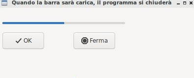

========
Timer(s)
========

.. i numeri degli esercizi sono 35x

* wx.Timer

* DateTime

* Calendar Widget(s)

wx.Gauge
========

La classe wx.Gauge rappresenta una widget che implementa una barra di avanzamento.

La barra di avanzamento va impostata indicando il range predefinito. In questo esempio ho messo range=10 e questo significa che la barra si caricherà come fosse
divisa in 10 pezzi. Per realizzare un esempio interessante ho aggiunto due caratteristiche avanzate che saranno spiegate successivamente (non vi preoccupate adesso
se non capite bene queste parti): un timer (classe **wx.Timer**) per far avanzare la barra di uno step automaticamente ogni secondo e 2 **pulsanti predefiniti** con
valori OK e STOP. Il Bind del timer è particolare, ma come dicevo... ci ritorneremo.

Nell'esempio proposto quando si clicca OK la barra comincia a caricarsi e può essere fermata cliccando STOP. Quando la barra è carica il programma si chiude.

.. code:: python

    import wx

    class Esempio(wx.Frame):
        
        def __init__(self):
            super().__init__(None, title="Quando la barra è carica, il programma si chiude")
            
            self.timer = wx.Timer(self,1)
            self.Bind(wx.EVT_TIMER, self.OnTimer, self.timer)        
            self.conta = 0
            
            pannello = wx.Panel(self)
            self.barra = wx.Gauge(pannello, range=10, pos=(5,5), size=(250,-1))
            self.btnOk = wx.Button(pannello, wx.ID_OK, pos=(5,50))
            self.btnStop = wx.Button(pannello, wx.ID_STOP, pos=(150,50))

            self.btnOk.Bind(wx.EVT_BUTTON, self.OnOk)
            self.btnStop.Bind(wx.EVT_BUTTON, self.OnStop)
                    
        def OnTimer(self, event):
            self.conta += 1
            if self.conta > 10:
                self.Close(True)
                return
            self.barra.SetValue(self.conta)
            return

        def OnOk(self, event):
            self.timer.Start(1000)
            return

        def OnStop(self, event):
            self.timer.Stop()
            return

    # ----------------------------------------
    app = wx.App()

    window = Esempio()
    window.Show()

    app.MainLoop()

Esercizi
========

.. 35x

.. con Timer e/o DateTime

orologio

cronometro

sveglia

semaforo

calendario

agenda

