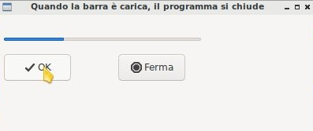

========
Timer(s)
========

.. i numeri degli esercizi sono 38x

I Timer sono oggetti molto comuni in ogni libreria OOP. Per la scansione del tempo si appoggiano tipicamente al clock di sistema, che teoricamente scandisce 
il milionesimo di secondo, ma che per motivi tecnici che non sto a spiegarvi (a lezione me lo chiederete, lo so: il bello dell'inutile) è affidabile appena 
al millesimo di secondo. Per quello che serve a noi, basta e avanza...

Un Timer è un oggetto della classe wx.Timer che gestisce appunto una scansione del tempo in millisecondi. Poiché ha già il suo bel daffare con questa questione 
del tempo vive sospeso rispetto al *Main Event Loop* e quindi non gestisce direttamente i suoi eventi, ma si appoggia alla sua widget parent. Detto così sembra complicato... vediamo un esempio commentato e capirete subito come funziona.

.. code:: python

  # dichiariamo un oggetto della classe wx.Timer
  # con la nostra widget come parent
  # Manteniamo un riferimento ad esso con una variabile membro (una del tipo self.var)
  # Se nella vostra app avete 2 timer, inserite un ID
  self.timer = wx.Timer(self)

  # facciamo il BIND tramite la parent widget: BIND(evento, funzione, oggetto)
  self.Bind(wx.EVT_TIMER, self.funzioneDaEseguire, self.timer)

Ecco qua! Come avete visto non è particolarmente complicato. Adesso il timer è pronto e collegato alla funzione da eseguire al timeout. 
Ma come si fa a far partire il timer? E a fermarlo? E... 

Come vediamo fra un attimo, per attivare un timer, basta invocare la funzione **Start(millisecondi)**. Se ad esempio invochiamo Start(100), ogni 100 millisecondi
il timer genererà un evento wx.EVT_TIMER che nel nostro esempio, scatenerà la *funzioneDaEseguire*.

Se avete necessità di fermare questa ripetizione infinita, usate la funzione **Stop()**. Ultima, ma non meno importante, se avete bisogno di eseguire una sola 
volta la funzione dilazionata nel tempo, ad esempio fra 10 secondi, avviate il timer con la funzione **StartOnce(10000)**.

.. code:: python

  # AVVIA il TIMER
  # Il parametro è in millisecondi. 
  # Significa che questo timer genererà un evento EVT_TIMER ogni secondo finchè non verrà fermato
  timer.Start(1000)
  
  # FERMA IL TIMER
  timer.Stop()
  
  # AVVIA IL TIMER per un'unica esecuzione
  # come Start() ma termina il timer al primo timeout
  timer.StartOnce(millisecondi)

Spero sia tutto chiaro :)

wx.Gauge
========

La classe wx.Gauge rappresenta una widget che implementa una barra di avanzamento.

La barra di avanzamento va impostata indicando il range predefinito. In questo esempio ho messo range=10 e questo significa che la barra si caricherà come fosse
divisa in 10 pezzi. Nell'esempio presentato abbiamo un timer per far avanzare la barra di uno step automaticamente ogni secondo e 2 pulsanti per fare OK e STOP.

Nell'esempio proposto quando si clicca OK la barra comincia a caricarsi e può essere fermata cliccando STOP. Quando la barra è carica il programma si chiude.

.. code:: python

    import wx

    class Esempio(wx.Frame):
        
        def __init__(self):
            super().__init__(None, title="Quando la barra è carica, il programma si chiude")
            
            self.timer = wx.Timer(self,1)
            self.Bind(wx.EVT_TIMER, self.OnTimer, self.timer)        
            self.conta = 0
            
            pannello = wx.Panel(self)
            self.barra = wx.Gauge(pannello, range=10, pos=(5,5), size=(250,-1))
            self.btnOk = wx.Button(pannello, label="OK", pos=(5,50))
            self.btnStop = wx.Button(pannello, label="STOP", pos=(150,50))

            self.btnOk.Bind(wx.EVT_BUTTON, self.OnOk)
            self.btnStop.Bind(wx.EVT_BUTTON, self.OnStop)
                    
        def OnTimer(self, event):
            self.conta += 1
            if self.conta > 10:
                self.Close(True)
                return
            self.barra.SetValue(self.conta)
            return

        def OnOk(self, event):
            self.timer.Start(1000)
            return

        def OnStop(self, event):
            self.timer.Stop()
            return

    # ----------------------------------------
    app = wx.App()

    window = Esempio()
    window.Show()

    app.MainLoop()

Esercizi
========

.. i numeri degli esercizi vanno da 38x

**Esercizio 381 (orologio)**

Implementare una semplice finestra con un'unica etichetta che visualizza un orologio funzionante (che scorre) con ore, minuti, secondi.

.. line::

**Esercizio 382 (cronometro)**

Implementare un cronometro con una etichetta con valore iniziale "00:00:00" rappresentanti rispettivamente minuti, secondi e centesimi di secondo 
e tre pulsanti per le funzioni START, STOP, RESET.

* START fa (ri)partire il cronometro

* STOP lo ferma.

* RESET lo (ri)imposta a ZERO

.. line::

**Esercizio 383 (semaforo)**

Applicazione con 4 immagini per 3 caselle: luce rossa, luce gialla, luce verde, luce grigia (luce spenta). Il semaforo inizia con la luce verde attiva
e le altre due grigie. Ogni 5 secondi si passa allo stadio successivo (luce gialla, poi luce rossa, poi si ritorna a luce verde, all'infinito).

