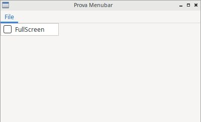
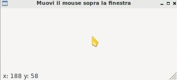
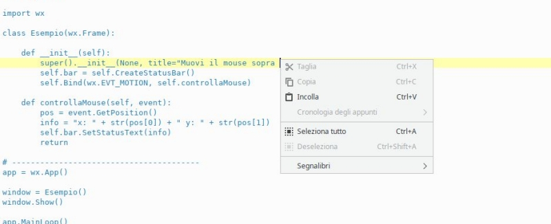
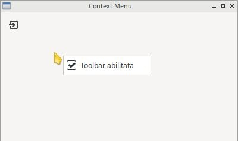

============
GUI complete
============

In questo capitolo cercheremo di introdurre tutti quegli elementi grafici che completano una GUI moderna: barra dei menù, azioni, icone, barre degli strumenti, etc...
Iniziamo subito!

Azioni predefinite
==================

Domanda a bruciapelo: pensate a Microsoft Word o a LibreOffice Writer e ditemi: *In quanti modi diversi si può fare copia e incolla?*

Tra scorciatoie da tastiera, pulsantini sulla barra degli strumenti, voci nei menù, contestuali e sulla barra, a me ne vengono in mente 
almeno 4... se non 5... Adesso mettetevi un secondo il vostro cappello da programmatore e rispondete alla prossima domanda: *Ma se uno può fare copia 
e incolla in 4 modi, significa che un altro lo ha implementato 4 volte?*

Fortunatamente la risposta a quest'ultima domanda è **no**! In questo contesto rientra un concetto tipico della programmazione grafica: il concetto
di **azione**. E cosa è un'azione? 

Un azione è un'astrazione di una funzionalità che il nostro programma vuole offrire all'utente. Viene identificata 
univocamente tramite un nome (ad esempio: COPIA), un'icona (...), una scorciatoia (CTRL + C), una descrizione.

La libreria wxPython per assicurare uniformità nelle azioni più comuni, come ad esempio APRI, SALVA, ESCI, etc... ha pensato bene di definirle tramite 
degli ID: ad esempio l'ID per l'azione SALVA si chiama wx.ID_SAVE. Voi identificate un pulsante con quell'ID e quello diventa automaticamente il pulsante
SALVA! Ha un testo, una scorciatoia, etc... 

Su Linux (precisamente, se wxPython utilizza il backend wxGTK) la nostra azione avrà anche un'icona di default. Purtroppo questo non vale per tutte le 
piattaforme supportate... poco male comunque! Possiamo inserire le icone necessarie tramite la classe **wx.ArtProvider**, come visto nella parte sulle immagini.

.. code:: python

    # immaginiamo di creare una generica azione SALVA
    var = wx.RobaGrafica( parent, id = wx.ID_SAVE , bitmap = wx.ArtProvider.GetBitmap(wx.ART_SAVE) )

    
Ok, ci manca solo l'elenco completo degli ID delle azioni predefinite in wxPython. Come noterete osservando la tabella e come spiegato prima, questi ID
hanno abbinata una etichetta (e una scorciatoia) predefinita, tipicamente in lingua inglese. La buona notizia è che wxPython supporta l'internazionalizzazione (i18n) e quindi se (ad esempio) il vostro sistema operativo è in lingua italiana, troverete le stringhe predefinite già
tradotte!!!

======================= ========================
ACTION ID               DEFAULT LABEL
======================= ========================
wx.ID_ABOUT             About
wx.ID_ADD               Add
wx.ID_APPLY             Apply
wx.ID_BACKWARD          Back
wx.ID_BOLD              Bold
wx.ID_BOTTOM            Bottom
wx.ID_CANCEL            Cancel
wx.ID_CDROM             CD-Rom
wx.ID_CLEAR             Clear
wx.ID_CLOSE             Close
wx.ID_CONVERT           Convert
wx.ID_COPY              Copy
wx.ID_CUT               Cut
wx.ID_DELETE            Delete
wx.ID_DOWN              Down
wx.ID_EDIT              Edit
wx.ID_EXECUTE           Execute
wx.ID_EXIT              Quit
wx.ID_FILE              File
wx.ID_FIND              Find
wx.ID_FIRST             First
wx.ID_FLOPPY            Floppy
wx.ID_FORWARD           Forward
wx.ID_HARDDISK          Harddisk
wx.ID_HELP              Help
wx.ID_HOME              Home
wx.ID_INDENT            Indent
wx.ID_INDEX             Index
wx.ID_INFO              Info
wx.ID_ITALIC            Italic
wx.ID_JUMP_TO           Jump to
wx.ID_JUSTIFY_CENTER    Centered
wx.ID_JUSTIFY_FILL      Justified
wx.ID_JUSTIFY_LEFT      Align Left
wx.ID_JUSTIFY_RIGHT     Align Right
wx.ID_LAST              Last
wx.ID_NETWORK           Network
wx.ID_NEW               New
wx.ID_NO                No
wx.ID_OK                Ok
wx.ID_OPEN              Open
wx.ID_PASTE             Paste
wx.ID_PREFERENCES       Preferences
wx.ID_PREVIEW           Print previe&w
wx.ID_PRINT             Print
wx.ID_PROPERTIES        Properties
wx.ID_REDO              Redo
wx.ID_REFRESH           Refresh
wx.ID_REMOVE            Remove
wx.ID_REPLACE           Replace
wx.ID_REVERT_TO_SAVED   Revert to Saved
wx.ID_SAVE              Save
wx.ID_SAVEAS            Save As
wx.ID_SELECTALL         Select All
wx.ID_SELECT_COLOR      Color
wx.ID_SELECT_FONT       Font
wx.ID_SORT_ASCENDING    Ascending
wx.ID_SORT_DESCENDING   Descending
wx.ID_SPELL_CHECK       Spell Check
wx.ID_STOP              Stop
wx.ID_STRIKETHROUGH     Strikethrough
wx.ID_TOP               Top
wx.ID_UNDELETE          Undelete
wx.ID_UNDERLINE         Underline
wx.ID_UNDO              Undo
wx.ID_UNINDENT          Unindent
wx.ID_UP                Up
wx.ID_YES               Yes
wx.ID_ZOOM_100          Actual Size
wx.ID_ZOOM_FIT          Zoom to Fit
wx.ID_ZOOM_IN           Zoom In
wx.ID_ZOOM_OUT          Zoom Out
======================= ========================

Menubar
=======

I menù sono oggetti grafici che tutti conosciamo e a cui tutti siamo abituati, non ho bisogno di grandi introduzioni! Poiché la nostra applicazione
iniziale (un oggetto della classe wx.Frame) è completamente spoglia, come prima cosa dovremo inserire una MenuBar (una barra dei menù) e quando
sarà pronta impostarla come barra della nostra Frame Widget:

.. code:: python

    mb = wx.MenuBar()
    
    # ... metti qualcosa nella MenuBar...
    
    window.SetMenuBar(mb)
    
  
Non appena avete creato la MenuBar, sarà possibile inserirvi dentro menù con azioni predefinite o personalizzate. Ecco alcuni esempi:

.. code:: python

    # 1) PRIMA crea il menù...
    fileMenu = wx.Menu()
    
    # 2) ...POI aggiungi alcune azioni...
    # inserimento DIRETTO di azione predefinita (senza icona su Windows e MacOS)
    fileItem = fileMenu.Append(wx.ID_EXIT)

    # inserimento DIRETTO di azione predefinita con TESTO e DESCRIZIONE personalizzati
    saveItem = fileMenu.Append(wx.ID_SAVE, "Salva bene :)", "Salva il documento corrente")
    
    # riga di separazione: serve solo come abbellimento
    fileMenu.AddSeparator()
    
    # creazione di un menuItem da azione predefinita, inserimento icona, aggiunta al menù
    saveItem = wx.MenuItem(fileMenu, wx.ID_OPEN)
    saveItem.SetBitmap(wx.ArtProvider.GetBitmap(wx.ART_FILE_OPEN))
    fileMenu.Append(saveItem)
    
    # creazione di una azione personalizzata con ID=35
    customItem = wx.MenuItem(fileMenu, 35, "Fai qualcosa")
    fileMenu.Append(customItem)

    # 3) ...INFINE aggiungi il menù alla menubar
    # (La & prima della F di File attiva la scorciatoia ALT + F)
    menubar.Append(fileMenu, '&File')
        
    
Si ottiene questo (come vedete, su Linux c'è un'icona in più...):

.. image:: images/wxMenuBar.jpg

Per collegare le azioni create ad una funzione (Binding) va intercettato l'evento wx.EVT_MENU abbinato all'ID della voce di menù in questione:

.. code:: python
  
    # per fare Bind dell'azione con ID = wx.ID_EXIT ad una funzione chiamata esci
    self.Bind(wx.EVT_MENU, self.esci, id=wx.ID_EXIT)
    
    # per fare Bind dell'azione con ID = 35 ad una funzione chiamata faiQualcosa
    self.Bind(wx.EVT_MENU, self.faiQualcosa, id=35)
    

Come al solito allego il codice completo dell'esempio proposto:

.. code:: python

    import wx

    class Esempio(wx.Frame):
        
        def __init__(self):
            super().__init__(None, title="Prova Menubar")
            
            menubar = wx.MenuBar()
            
            fileMenu = wx.Menu()
        
            # inserimento DIRETTO di azione predefinita (senza icona su Windows e MacOS)
            fileItem = fileMenu.Append(wx.ID_EXIT)

            # inserimento DIRETTO di azione predefinita con TESTO e DESCRIZIONE personalizzati
            saveItem = fileMenu.Append(wx.ID_SAVE, "Salva bene :)", "Salva il documento corrente")
            
            # riga di separazione: serve solo come abbellimento
            fileMenu.AppendSeparator()
            
            # creazione di un menuItem da azione predefinita, inserimento icona, aggiunta al menù
            saveItem = wx.MenuItem(fileMenu, wx.ID_OPEN)
            saveItem.SetBitmap(wx.ArtProvider.GetBitmap(wx.ART_FILE_OPEN))
            fileMenu.Append(saveItem)
        
            # creazione di una azione personalizzata con ID=35
            customItem = wx.MenuItem(fileMenu, 35, "Fai qualcosa")
            fileMenu.Append(customItem)
            
            menubar.Append(fileMenu, '&File')
            self.SetMenuBar(menubar)
            
            self.Bind(wx.EVT_MENU, self.chiudi, id=wx.ID_EXIT)
            self.Bind(wx.EVT_MENU, self.faiQualcosa, id=35)

        def chiudi(self, event):
            self.Close(True)
            return
        
        def faiQualcosa(self,event):
            dial = wx.MessageDialog(None, "E cosa dovrei fare?", "Esclamazione", wx.OK | wx.ICON_EXCLAMATION)
            dial.ShowModal()
            
    # ----------------------------------------
    app = wx.App()
    window = Esempio()
    window.Show()
    app.MainLoop()

    
Check Items
-----------

Devo aggiungere a questo punto una caratteristica della classe wx.MenuItem, ovvero quella che implementa le voci di menù e può presentarsi sotto
forme diverse: noi ne vedremo solo due, di cui una (la forma *NORMALE*) è quella di tutte le voci di menù viste fino ad ora. 

La seconda forma interessante (dal nostro punto di vista) è quella denominata **ITEM_CHECK**: le azioni in questa forma presentano (oppure no) un tick
di attivazione e stanno alle azioni normali come i ToggleButton stanno ai Button. Come accennato, quando clicchi su queste azioni si attiva un tick su di esse che si disabilita al click successivo. Utili per azioni a due stati (es: visualizza/nascondi barra di stato, attiva/disattiva fullscreen, etc..)

Per implementare un *Check Item* ripropongo un esempio che attiva e disattiva il fullscreen (già visto):

.. code:: python

    import wx

    class Esempio(wx.Frame):
        
        def __init__(self):
            super().__init__(None, title="Prova Menubar")
            
            self.menubar = wx.MenuBar()
            fileMenu = wx.Menu()
            
            # Esempio di CHECK MENU ITEM completamente personalizzato
            self.fsItem = wx.MenuItem(fileMenu, id=100, text="FullScreen", kind=wx.ITEM_CHECK)
            fileMenu.Append(self.fsItem)
            
            self.menubar.Append(fileMenu, '&File')
            self.SetMenuBar(self.menubar)
            
            self.Bind(wx.EVT_MENU, self.mettiFullScreen, id=100)

        def mettiFullScreen(self, event):
            if self.fsItem.IsChecked():
                # style = 0 serve per non nascondere la menubar quando si è fullscreen
                self.ShowFullScreen(True, style=0)
                self.fsItem.SetItemLabel("Exit fullscreen")
            else:
                self.ShowFullScreen(False)
                self.fsItem.SetItemLabel("Fullscreen")
            return
            
    # ----------------------------------------
    app = wx.App()
    window = Esempio()
    window.Show()
    app.MainLoop()

Toolbar
=======

Se le barre dei menù dovrebbero permettere l'accesso a **tutte** le funzioni disponibili in una applicazione, le barre degli strumenti dovrebbero permettere
l'accesso alle azioni veloci, ovvero a quelle di maggior utilizzo per gli utenti.

Per aggiungere una Toolbar alla nostra Frame Widget dobbiamo utilizzare la funzione `CreateToolBar()` a cui poi potremo aggiungere le azioni che ci interessano.

.. code:: python

    toolbar = window.CreateToolBar()
    
    toolbar.AddTool(...e qui si aggiungono le azioni una ad una...)
    
    # riempita la toobar, va eseguito il metodo Realize()
    toolbar.Realize()

Facciamo anche qui un esempio con 2 azioni e un separatore: la prima azione sarà un azione standard, mentre la seconda una azione personalizzata:

.. code:: 

    # ...
    # azione standard: ID, descrizione, icona
    exitTool = toolbar.AddTool( wx.ID_EXIT, "ESCI", wx.ArtProvider.GetBitmap(wx.ART_QUIT) )
    
    # un separatore: come abbellimento e per vedere come si fa :)
    toolbar.AddSeparator()
    
    # azione personalizzata: ID, descrizione, icona
    questionTool = toolbar.AddTool( 73 , "Fai una domanda" , wx.ArtProvider.GetBitmap(wx.ART_QUESTION) )

A questo punto, se volete collegare i pulsanti della Toolbar ad una funzione, basta eseguire il solito Bind() con l'evento **wx.EVT_TOOL**.

.. code:: 

    self.Bind(wx.EVT_TOOL, self.esci, exitTool )
    self.Bind(wx.EVT_TOOL, self.dattiUnaRisposta, exitTool )

    
Come al solito, propongo l'esempio completo delle toolbar.

.. code::

    import wx

    class Esempio(wx.Frame):
        
        def __init__(self):
            super().__init__(None, title="Prova Toolbar")
            
            toolbar = self.CreateToolBar()
            
            exitTool = toolbar.AddTool( wx.ID_EXIT, "ESCI", wx.ArtProvider.GetBitmap(wx.ART_QUIT) )
            toolbar.AddSeparator()
            questionTool = toolbar.AddTool( 73 , "Fai una domanda" , wx.ArtProvider.GetBitmap(wx.ART_QUESTION) )

            toolbar.Realize()

            self.Bind(wx.EVT_TOOL, self.esci, exitTool)
            self.Bind(wx.EVT_TOOL, self.dattiUnaRisposta, questionTool)

        def esci(self, event):
            self.Close(True)
            return
        
        def dattiUnaRisposta(self,event):
            dial = wx.MessageDialog(None, "Bravo!", "Risposta", wx.OK | wx.ICON_EXCLAMATION)
            dial.ShowModal()
            
    # ----------------------------------------
    app = wx.App()
    window = Esempio()
    window.Show()
    app.MainLoop()

.. warning::
    L'evento EVT_TOOL è automaticamente abbinato ad un evento EVT_MENU e viceversa. Questo significa che se, ad esempio, avete già implementato
    tutte le vostre azioni nella MenuBar e fatto il Binding con i loro ID con le opportune funzioni, tutte le azioni che aggiungerete alla toolbar
    con ID già utilizzati funzioneranno automaticamente senza bisogno di un ulteriore binding!!!
    
    
Vediamo una semplicissima dimostrazione di ciò con una finestra avente una sola azione, presente sia nella menubar che nella toolbar.

.. code::

    import wx

    class Esempio(wx.Frame):
        
        def __init__(self):
            super().__init__(None, title="Stessa azione: menu & toolbar")

            menubar = wx.MenuBar()
            fileMenu = wx.Menu()
            fileItem = fileMenu.Append(wx.ID_EXIT)
            menubar.Append(fileMenu, '&File')
            self.SetMenuBar(menubar)
            
            self.Bind(wx.EVT_MENU, self.esci, id=wx.ID_EXIT)
            
            toolbar = self.CreateToolBar()
            toolbar.AddTool( wx.ID_EXIT, "ESCI", wx.ArtProvider.GetBitmap(wx.ART_QUIT) )
            toolbar.Realize()

        def esci(self, event):
            self.Close(True)
            return
            
    # ----------------------------------------
    app = wx.App()
    window = Esempio()
    window.Show()
    app.MainLoop()

wx.StatusBar
============

La classe wx.StatusBar rappresenta una widget che implementa la barra di stato delle applicazioni.

E' possibile creare una barra di stato in due modi: o dichiarando un oggetto di tipo wx.StatusBar e poi inserendolo
nella finestra tramite il metodo *SetStatusBar()* oppure chiamando direttamente dalla finestra il metodo *CreateStatusBar()*.
Se dovete solo visualizzare informazioni il secondo metodo è una bomba! Se dovete modificare la StatusBar aggiungendovi widget e icone
serve il primo metodo, eventualmente creando una classe derivata da wx.StatusBar.

Nell'esempio proposto si crea automaticamente una StatusBar e si visualizza la posizione del puntatore non appena questo entra nella finestra.

.. code:: python

    import wx

    class Esempio(wx.Frame):
        
        def __init__(self):
            super().__init__(None, title="Muovi il mouse sopra la finestra")        
            self.bar = self.CreateStatusBar()
            self.Bind(wx.EVT_MOTION, self.controllaMouse)
            
        def controllaMouse(self, event):
            pos = event.GetPosition()
            info = "x: " + str(pos[0]) + " y: " + str(pos[1])
            self.bar.SetStatusText(info)
            return
        
    # ----------------------------------------
    app = wx.App()

    window = Esempio()
    window.Show()

    app.MainLoop()

    
Context Menu
============

I *Context Menus* ovvero i menù contestuali sono quei menù che appaiono quando si fa click con il tasto destro in determinate posizione della nostra applicazione.
Risulta chiaro a mio avviso che i Context Menu dipendono dalla widget sopra la quale si fa click con il tasto destro. Un immagine vale più di 1000 parole:

Per capire come si può implementare un Context Menu tramite la libreria wxPython proviamo ad implementarne uno su una widget con dentro un check item che abilita
o disabilita la toolbar, rendendo possibile in quest'ultimo caso utilizzare i suoi strumenti.

.. code:: python

    import wx

    class Esempio(wx.Frame):
        
        def __init__(self):
            super().__init__(None, title="Context Menu")
            
            self.toolbar = self.CreateToolBar()        
            exitTool = self.toolbar.AddTool( wx.ID_EXIT, "ESCI", wx.ArtProvider.GetBitmap(wx.ART_QUIT) )
            self.toolbar.Realize()

            self.Bind(wx.EVT_TOOL, self.esci, exitTool)
            
            # serve ad attivare il Context Menu
            self.Bind(wx.EVT_RIGHT_DOWN, self.OnRightDown)

            # Crea il menù, pronto per essere attivato!
            self.contextMenu = wx.Menu()
            self.fsItem = wx.MenuItem(self.contextMenu, id=100, text="Toolbar abilitata", kind=wx.ITEM_CHECK)
            self.contextMenu.Append(self.fsItem)
            self.contextMenu.Check(100, True)
            self.Bind(wx.EVT_MENU, self.ManageToolBar, self.fsItem)
                    
        def esci(self, event):
            self.Close(True)
            return
        
        def OnRightDown(self, event):
            self.PopupMenu(self.contextMenu, event.GetPosition())

        def ManageToolBar(self,event):
            if self.fsItem.IsChecked():
                self.toolbar.Enable(True)
            else:
                self.toolbar.Enable(False)
            
    # ----------------------------------------
    app = wx.App()
    window = Esempio()
    window.Show()
    app.MainLoop()

Il risultato di questo codice è il seguente:

Spero che osservare e riprodurre l'esempio sia sufficiente per capire il funzionamento :)

SystemSettings
==============
