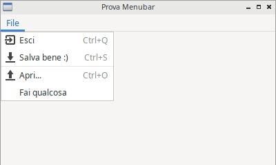

============
GUI complete
============

In questo capitolo cercheremo di introdurre tutti quegli elementi grafici che completano una GUI moderna: barra dei menù, azioni, icone, barre degli strumenti, etc...
Iniziamo subito!

Pulsanti predefiniti
====================

Domanda a bruciapelo: pensate a Microsoft Word o a LibreOffice Writer e ditemi: *In quanti modi diversi si può fare copia e incolla?*

Tra scorciatoie da tastiera, pulsantini sulla barra degli strumenti, voci nei menù, contestuali e sulla barra, a me ne vengono in mente 
almeno 4... se non 5... Adesso mettetevi un secondo il vostro cappello da programmatore e rispondete alla prossima domanda: *Ma se uno può fare copia 
e incolla in 4 modi, significa che un altro lo ha implementato 4 volte?*

Fortunatamente la risposta a quest'ultima domanda è **no**! In questo contesto rientra un concetto tipico della programmazione grafica: il concetto
di **azione**. E cosa è un'azione? 

Un azione è un'astrazione di una funzionalità che il nostro programma vuole offrire all'utente. Viene identificata 
univocamente tramite un nome (ad esempio: COPIA), un'icona (...), una scorciatoia (CTRL + C), una descrizione.

La libreria wxPython per assicurare uniformità nelle azioni più comuni, come ad esempio APRI, SALVA, ESCI, etc... ha pensato bene di definirle tramite 
degli ID: ad esempio l'ID per l'azione SALVA si chiama wx.ID_SAVE. Voi identificate un pulsante con quell'ID e quello diventa automaticamente il pulsante
SALVA! Ha un testo, una scorciatoia, etc... 

Su Linux (precisamente, se wxPython utilizza il backend wxGTK) la nostra azione avrà anche un'icona di default. Purtroppo questo non vale per tutte le 
piattaforme supportate... poco male comunque! Possiamo inserire le icone necessarie tramite la classe **wx.ArtProvider**, come visto nella parte sulle immagini.

.. code:: python

    # è solo un esempio per dare un'idea... è chiaro sì?
    var = wx.RobaGrafica( parent, id = wx.ID_SAVE , bitmap = wx.ArtProvider.GetBitmap(wx.ART_SAVE) )

    
Ok, ci manca solo l'elenco completo degli ID delle azioni predefinite in wxPython. Eccolo:

======================= ========================
ACTION ID               DEFAULT LABEL
======================= ========================
wx.ID_ABOUT             About
wx.ID_ADD               Add
wx.ID_APPLY             Apply
wx.ID_BACKWARD          Back
wx.ID_BOLD              Bold
wx.ID_BOTTOM            Bottom
wx.ID_CANCEL            Cancel
wx.ID_CDROM             CD-Rom
wx.ID_CLEAR             Clear
wx.ID_CLOSE             Close
wx.ID_CONVERT           Convert
wx.ID_COPY              Copy
wx.ID_CUT               Cut
wx.ID_DELETE            Delete
wx.ID_DOWN              Down
wx.ID_EDIT              Edit
wx.ID_EXECUTE           Execute
wx.ID_EXIT              Quit
wx.ID_FILE              File
wx.ID_FIND              Find
wx.ID_FIRST             First
wx.ID_FLOPPY            Floppy
wx.ID_FORWARD           Forward
wx.ID_HARDDISK          Harddisk
wx.ID_HELP              Help
wx.ID_HOME              Home
wx.ID_INDENT            Indent
wx.ID_INDEX             Index
wx.ID_INFO              Info
wx.ID_ITALIC            Italic
wx.ID_JUMP_TO           Jump to
wx.ID_JUSTIFY_CENTER    Centered
wx.ID_JUSTIFY_FILL      Justified
wx.ID_JUSTIFY_LEFT      Align Left
wx.ID_JUSTIFY_RIGHT     Align Right
wx.ID_LAST              Last
wx.ID_NETWORK           Network
wx.ID_NEW               New
wx.ID_NO                No
wx.ID_OK                Ok
wx.ID_OPEN              Open
wx.ID_PASTE             Paste
wx.ID_PREFERENCES       Preferences
wx.ID_PREVIEW           Print previe&w
wx.ID_PRINT             Print
wx.ID_PROPERTIES        Properties
wx.ID_REDO              Redo
wx.ID_REFRESH           Refresh
wx.ID_REMOVE            Remove
wx.ID_REPLACE           Replace
wx.ID_REVERT_TO_SAVED   Revert to Saved
wx.ID_SAVE              Save
wx.ID_SAVEAS            Save As
wx.ID_SELECTALL         Select All
wx.ID_SELECT_COLOR      Color
wx.ID_SELECT_FONT       Font
wx.ID_SORT_ASCENDING    Ascending
wx.ID_SORT_DESCENDING   Descending
wx.ID_SPELL_CHECK       Spell Check
wx.ID_STOP              Stop
wx.ID_STRIKETHROUGH     Strikethrough
wx.ID_TOP               Top
wx.ID_UNDELETE          Undelete
wx.ID_UNDERLINE         Underline
wx.ID_UNDO              Undo
wx.ID_UNINDENT          Unindent
wx.ID_UP                Up
wx.ID_YES               Yes
wx.ID_ZOOM_100          Actual Size
wx.ID_ZOOM_FIT          Zoom to Fit
wx.ID_ZOOM_IN           Zoom In
wx.ID_ZOOM_OUT          Zoom Out
======================= ========================

Menubar
=======

I menù sono oggetti grafici che tutti conosciamo e a cui tutti siamo abituati, non ho bisogno di grandi introduzioni! Poiché la nostra applicazione
iniziale (un oggetto della classe wx.Frame) è completamente spoglia, come prima cosa dovremo inserire una MenuBar (una barra dei menù) e quando
sarà pronta impostarla come barra della nostra Frame Widget:

.. code:: python

    mb = wx.MenuBar()
    
    # ... metti qualcosa nella MenuBar...
    
    window.SetMenuBar(mb)
    
  
A questo punto sarà possibile inserire menù creandoli e inserendovi dentro azioni predefinite o personalizzate:

.. code:: python

    fileMenu = wx.Menu()
    
    # esempio di azione predefinita. Troppo veloce!!!
    fileItem = fileMenu.Append(wx.ID_EXIT)

    # esempio di azione personalizzata con ID=35
    customItem = wx.MenuItem(fileMenu, 35, "Fai qualcosa")
    fileMenu.Append(customItem)

Si ottiene questo:

Per collegare le azioni create ad una funzione (Binding) va intercettato l'evento wx.EVT_MENU:

.. code:: python
  
    # per fare Bind dell'azione con ID = wx.ID_EXIT ad una funzione chiamata esci
    self.Bind(wx.EVT_MENU, self.esci, id=wx.ID_EXIT)
    
    # per fare Bind dell'azione con ID = 35 ad una funzione chiamata faiQualcosa
    self.Bind(wx.EVT_MENU, self.faiQualcosa, id=35)
    

Come al solito allego il codice completo dell'esempio proposto:

.. code:: python

    import wx

    class Esempio(wx.Frame):
        
        def __init__(self):
            super().__init__(None, title="Prova Menubar")
            
            panel = wx.Panel(self)        
            menubar = wx.MenuBar()
            
            fileMenu = wx.Menu()
            exitItem = fileMenu.Append(wx.ID_EXIT)
            customItem = wx.MenuItem(fileMenu, 35, "Fai qualcosa")
            fileMenu.Append(customItem)
            
            # Aggiungo il menù creato come menù File (con F come scorciatoia)
            menubar.Append(fileMenu, '&File')
            self.SetMenuBar(menubar)
            
            self.Bind(wx.EVT_MENU, self.chiudi, id=wx.ID_EXIT)
            self.Bind(wx.EVT_MENU, self.faiQualcosa, id=35)

        def chiudi(self, event):
            self.Close(True)
            return
        
        def faiQualcosa(self,event):
            dial = wx.MessageDialog(None, "E cosa dovrei fare?", "Esclamazione", wx.OK | wx.ICON_EXCLAMATION)
            dial.ShowModal()
            
    # ----------------------------------------
    app = wx.App()
    window = Esempio()
    window.Show()
    app.MainLoop()

Toolbar
=======

Le barre degli strumenti permettono, nelle GUI moderne, l'accesso veloce alle azioni di maggior utilizzo per gli utenti. Per aggiungere una Toolbar alla
nostra Frame Widget dobbiamo utilizzare la funzione `CreateToolBar()` a cui poi potremo aggiungere le azioni che ci interessano.

.. code:: python

    toolbar = window.CreateToolBar()
    
    toolbar.AddTool(...e qui si aggiungono le azioni una ad una...)
    
    # riempita la toobar, va eseguito il metodo Realize()
    toolbar.Realize()

wx.StatusBar
============

La classe wx.StatusBar rappresenta una widget che implementa la barra di stato delle applicazioni.

.. image:: images/wxStatusBar.jpg

E' possibile creare una barra di stato in due modi: o dichiarando un oggetto di tipo wx.StatusBar e poi inserendolo
nella finestra tramite il metodo *SetStatusBar()* oppure chiamando direttamente dalla finestra il metodo *CreateStatusBar()*.
Se dovete solo visualizzare informazioni il secondo metodo è una bomba! Se dovete modificare la StatusBar aggiungendovi widget e icone
serve il primo metodo, eventualmente creando una classe derivata da wx.StatusBar.

Nell'esempio proposto si crea automaticamente una StatusBar e si visualizza la posizione del puntatore non appena questo entra nella finestra.

.. code:: python

    import wx

    class Esempio(wx.Frame):
        
        def __init__(self):
            super().__init__(None, title="Muovi il mouse sopra la finestra")        
            self.bar = self.CreateStatusBar()
            self.Bind(wx.EVT_MOTION, self.controllaMouse)
            
        def controllaMouse(self, event):
            pos = event.GetPosition()
            info = "x: " + str(pos[0]) + " y: " + str(pos[1])
            self.bar.SetStatusText(info)
            return
        
    # ----------------------------------------
    app = wx.App()

    window = Esempio()
    window.Show()

    app.MainLoop()

    
Context Menu
============

SystemSettings
==============
