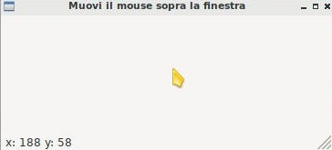

==================
Menus and Toolbars
==================

* Menus
* Toolbars
* Pulsanti predefiniti
* wx.SystemSettings
* StatusBar

wx.StatusBar
============

La classe wx.StatusBar rappresenta una widget che implementa la barra di stato delle applicazioni.

E' possibile creare una barra di stato in due modi: o dichiarando un oggetto di tipo wx.StatusBar e poi inserendolo
nella finestra tramite il metodo *SetStatusBar()* oppure chiamando direttamente dalla finestra il metodo *CreateStatusBar()*.
Se dovete solo visualizzare informazioni il secondo metodo è una bomba! Se dovete modificare la StatusBar aggiungendovi widget e icone
serve il primo metodo, eventualmente creando una classe derivata da wx.StatusBar.

Nell'esempio proposto si crea automaticamente una StatusBar e si visualizza la posizione del puntatore non appena questo entra nella finestra.

.. code:: python

    import wx

    class Esempio(wx.Frame):
        
        def __init__(self):
            super().__init__(None, title="Muovi il mouse sopra la finestra")        
            self.bar = self.CreateStatusBar()
            self.Bind(wx.EVT_MOTION, self.controllaMouse)
            
        def controllaMouse(self, event):
            pos = event.GetPosition()
            info = "x: " + str(pos[0]) + " y: " + str(pos[1])
            self.bar.SetStatusText(info)
            return
        
    # ----------------------------------------
    app = wx.App()

    window = Esempio()
    window.Show()

    app.MainLoop()

