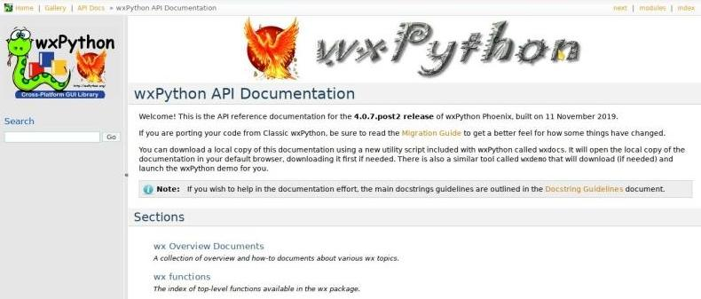

======
wxdocs
======

La libreria wxPython fornisce alcuni semplici strumenti di supporto alla programmazione. Il primo che andiamo ad incontrare è il tool denominato **wxdocs**: esso permette di scaricare sul proprio dispositivo una copia della documentazione ufficiale, per la consultazione off-line.

Se avete già installato wxPython potete scaricare una copia locale della documentazione intera senza faticare tramite lo strumento chiamato **wxdocs**. 
Aprite un terminale ed eseguitelo:

.. code:: bash

    $ wxdocs

Questo aprirà sul vostro browser di default la copia locale della documentazione, scaricandola prima se non la trova disponibile.

Così potete consultarla comodamente offline in qualsiasi momento. Analoga soluzione sarà utilizzata durante le verifiche di laboratorio!

