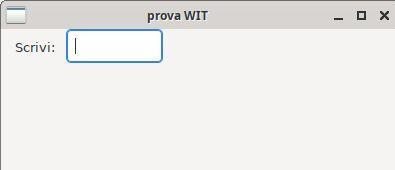
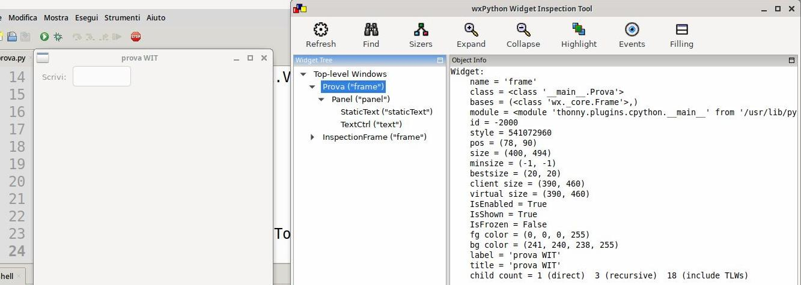
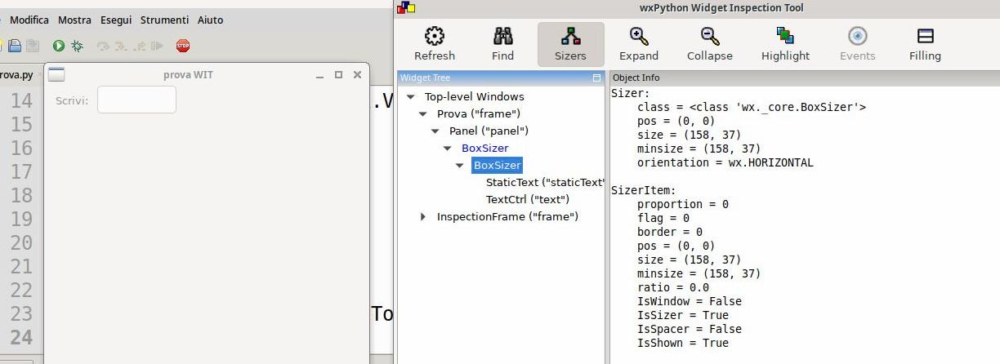
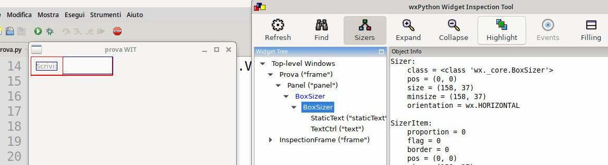
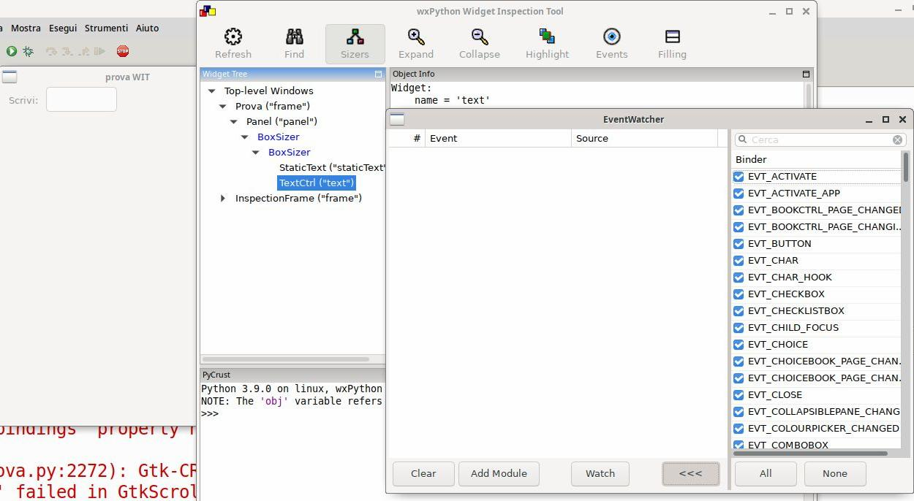

======================
widget inspection tool
======================

La libreria wxPython fornisce uno strumento molto interessante per l'analisi delle widget in fase di creazione: lo **Widget Inspection Tool**. Questo strumento può essere utilizzato per analizzare il layout definito in una widget e le funzionalità grafiche implementate in essa (eventi, main loop, etc...).

Per utilizzarlo è necessario aggiungere semplicemente 2 righe di codice al main di una applicazione e rieseguire il suo codice:

.. code:: python

    import wx.lib.inspection
    wx.lib.inspection.InspectionTool().Show()
    

Come vedete non è nulla di complicato. Cerchiamo però di capire quale può essere l'utilità di utilizzare uno strumento del genere, come al solito partendo
da un esempio.	

Questo stupido esempio qui sotto non funziona bene. Perché? Il Widget Inspection Tool potrebbe aiutarci a capirlo...

.. code:: python

	import wx
	
	class Prova(wx.Frame):
    	def __init__(self, title):
            super().__init__(None,title=title)
            panel = wx.Panel(self)
        	
            testo = wx.StaticText(panel,label="Scrivi:")
            self.riga = wx.TextCtrl(panel)
            hbox = wx.BoxSizer(wx.HORIZONTAL)
            hbox.Add(testo, flag=wx.ALL, border=10)
            hbox.Add(self.riga, proportion=1)
        	
            box = wx.BoxSizer(wx.VERTICAL)
            box.Add(hbox)
        	
            panel.SetSizer(box)
	
    app = wx.App()
    w = Prova("prova WIT")
    w.Show()
    app.MainLoop()
	

Se analizzate un pochino l'esempio sopra, vi accorgerete che ho inserito un testo statico e una linea di testo in un sizer orizzontale. Ho messo un pò di bordo nel primo
per allinearlo al meglio, ho messo proportion=1 al secondo per farlo ingrandire con la finestra... insomma tutto ok. Poi ho inserito il layout in un sizer verticale
che ho applicato al pannello. In questo modo potrò semplicemente aggiungere *righe* di oggetti alla mia applicazione. 

Il risultato che ottengo è visualizzato qui sotto:

Come si vede non ho ottenuto un layout bello esteso ma piccolo e non ridimensionabile. L'esempio è semplice e i più intuituivi avranno già capito il problema. Per tutti
gli altri si può utilizzare uno strumento in più: il **Widget Inspection Tool**.

Come detto sopra, per utilizzarlo basta modificare il codice sopra aggiungendo le due righe indicate **prima** di far partire il mainloop. Io ho fatto così:

.. code:: python

    # ... modifico il codice vicino alle chiamate principali ...
    app = wx.App()
    w = Prova("prova WIT")
    w.Show()
    import wx.lib.inspection
    wx.lib.inspection.InspectionTool().Show()
    app.MainLoop()

ottenendo questo:

Come vedete lo strumento chiamato **Widget Inspection Tool** fa quello che promette: permette di analizzare le finestre a cui viene *abbinato*, elencando tutti
gli oggetti con i relativi attributi presenti.

Come vedete però, non ci sono i sizer(s): se li volete visualizzare, vanno abilitati cliccando sull'opportuno pulsante *Sizers* sullo strumento:

Adesso che li vedete sullo strumento e volete controllare come si comportano nella widget, vi basta cliccare sul pulsante *Highlight* per farlo.

Questo ci fa capire immediatamente che il problema del nostro layout è il sizer orizzontale che non va ad occupare tutto lo spazio disponibile nel sizer verticale.
Si risolve modificando il codice come segue:

.. code:: python

    # ...
    box.Add(hbox, proportion=1)
    # ...

Un ultima cosa molto importante del Widget Inspection Tool è che può aiutarci a tracciare il comportamento anche degli eventi che accadono alle finestre che implementiamo.
Per vedere questa sua funzionalità bisogna prima selezionare la widget che ci interessa, poi premere il pulsante *Events* che mostrerà una nuova finestra con un elenco
degli eventi disponibili per quell'oggetto.

A questo punto ci basta provare ad utilizzare la nostra finestra:

Adesso il segreto non tanto segreto è provare ad utilizzare questo strumento ogni volta che qualcosa non quadra per provare a *ispezionare* i nostri capolavori :)
