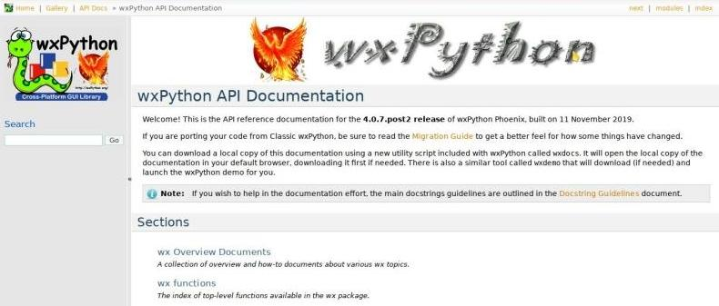
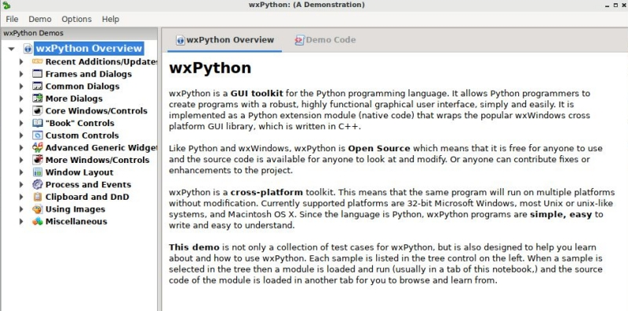

========
wx Tools
========

La libreria wxPython fornisce due semplici strumenti per reperire localmente la documentazione e gli esempi principali della libreria stessa. Utilizzandoli avrete
la comodità di avere tutta la documentazione disponibile offline, oltre che la possibilità di accedere ad una miriade di esempi di codice già scritti e pronti all'uso
e alla consultazione.

wxdocs
======

Se avete già installato wxPython potete scaricare una copia locale della documentazione intera senza faticare semplicemente eseguendo 
il tool **wxdocs**. Questo aprirà sul vostro browser di default la copia locale della documentazione, scaricandola prima se non la trova disponibile.

Così potete consultarla comodamente offline in qualsiasi momento. Analoga soluzione sarà utilizzata durante le verifiche di laboratorio!

wxdemo
======

In maniera analoga, se volete vedere esempi di codice e vedere il risultato di quello che riescono a produrre potete eseguire lo script chiamato **wxdemo**.
Lo screenshot sotto è relativo ad esso.

Cliccate su uno dei gruppi che vi interessano, date un occhio al codice e assolutamente eseguitelo per vederne il risultato!

